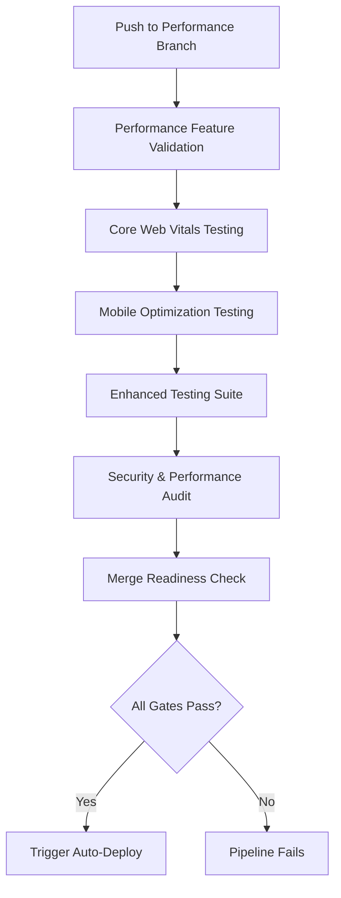
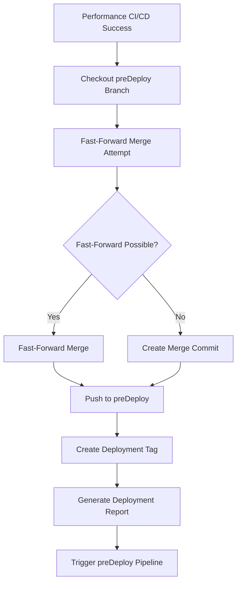
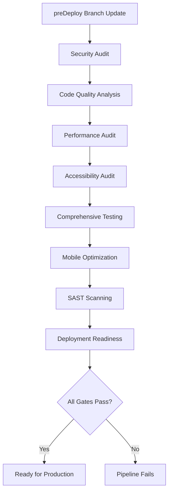
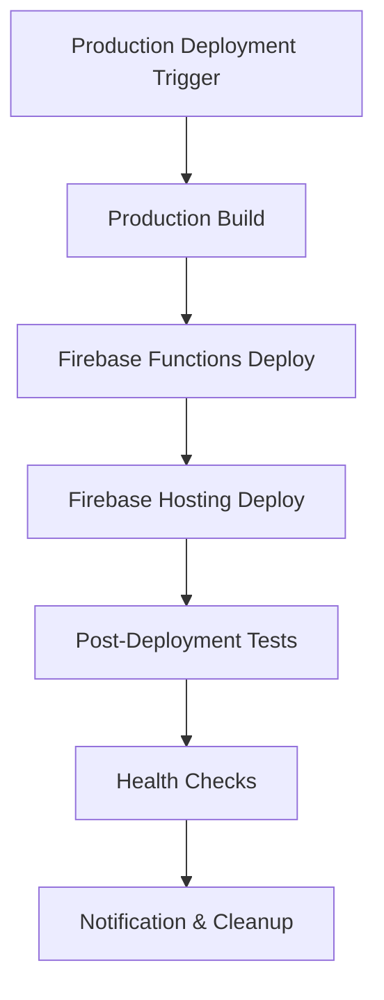

# 🚀 RankPilot Workflows Analysis & Execution Flow

## 📋 **CURRENT WORKFLOW INVENTORY**

### **Active Workflow Files in `.github/workflows/`:**

| **File** | **Status** | **Triggers** | **Purpose** |
|----------|------------|--------------|-------------|
| `feature-performance-ci-cd.yml` | ✅ **ACTIVE** | `feature/performance-*` branches, PRs to master/preDeploy | NEW: Performance-focused CI/CD with Core Web Vitals |
| `performance-auto-deploy.yml` | ✅ **ACTIVE** | Triggered by successful feature-performance-ci-cd | NEW: Auto-deployment to preDeploy branch |
| `pre-deployment-pipeline.yml` | ✅ **ACTIVE** | `preDeploy` branch pushes/PRs | Enterprise 8-stage quality validation |
| `production-deploy.yml` | ✅ **ACTIVE** | `master` branch pushes, manual dispatch | Production deployment to rankpilot-h3jpc.web.app |
| `feature-branch-deploy.yml` | ⚠️ **REDUNDANT** | `feature/**` branches | Superseded by feature-performance-ci-cd |
| `README.md` | 📚 **DOCUMENTATION** | N/A | Legacy documentation for performance testing |
| `DEFINITIVE_WORKFLOW_GUIDE.md` | 📄 **EMPTY FILE** | N/A | Empty placeholder file |

---

## 🔄 **WORKFLOW REDUNDANCY ANALYSIS**

### **⚠️ REDUNDANT WORKFLOWS:**

#### **1. `feature-branch-deploy.yml`** - **REDUNDANT**
**Why Redundant:**
- Overlaps with new `feature-performance-ci-cd.yml`
- Both trigger on `feature/**` branches
- Less comprehensive than new performance-focused pipeline
- Lacks Core Web Vitals and mobile optimization validation

**Recommendation:** 🗑️ **REMOVE** - Fully superseded by enhanced pipeline

#### **2. `README.md`** - **OUTDATED DOCUMENTATION**
**Why Redundant:**
- Documents old workflow patterns
- References deprecated testing approaches
- No longer matches current implementation

**Recommendation:** 🔄 **UPDATE** - Replace with current workflow documentation

#### **3. `DEFINITIVE_WORKFLOW_GUIDE.md`** - **EMPTY FILE**
**Why Redundant:**
- Empty placeholder with no content
- Serves no functional purpose

**Recommendation:** 🗑️ **REMOVE** - No value provided

---

## 🎯 **NEW WORKFLOW EXECUTION FLOW**

### **STAGE 1: Performance Branch Development**
**Workflow:** `feature-performance-ci-cd.yml`
**Trigger:** Push to `feature/performance-optimization-mobile-enhancement`



**Execution Details:**
1. **Performance Feature Validation** (5-7 min)
   - Performance-optimized dependency installation
   - Bundle analysis with `ANALYZE=true`
   - TypeScript and ESLint validation
   - Memory allocation: 6144MB for AI components

2. **Core Web Vitals Testing** (8-12 min)
   - Lighthouse CI with 90% performance threshold
   - Mobile performance testing with device emulation
   - Performance metrics analysis
   - Automatic failure if score < 90%

3. **Mobile Optimization Testing** (3-5 min)
   - Mobile-specific test execution
   - 48px touch target validation
   - Accessibility compliance (WCAG 2.1)
   - Responsive design validation

4. **Enhanced Testing Suite** (10-15 min)
   - Matrix strategy: [critical, high-memory, warmed]
   - High-memory configurations for AI components
   - Production environment simulation
   - Comprehensive test coverage

5. **Security & Performance Audit** (3-5 min)
   - Security audit with performance focus
   - Environment configuration validation
   - Performance-specific security checks

6. **Merge Readiness Check** (2-3 min)
   - Final build validation
   - Performance metrics reporting
   - Quality gate summary

**Total Execution Time:** ~30-47 minutes

---

### **STAGE 2: Auto-Deployment to preDeploy**
**Workflow:** `performance-auto-deploy.yml`
**Trigger:** Successful completion of feature-performance-ci-cd



**Execution Details:**
1. **Auto-Deploy to preDeploy** (2-3 min)
   - Fast-forward merge to preDeploy branch
   - Fallback to merge commit if needed
   - Automated conflict resolution

2. **Deployment Tagging** (1 min)
   - Timestamped deployment tags
   - Comprehensive deployment metadata
   - Performance validation summary

3. **Report Generation** (1 min)
   - Deployment status documentation
   - Quality gate validation summary
   - Next steps and recommendations

4. **Pipeline Triggering** (1 min)
   - Activates preDeploy quality pipeline
   - Initiates production readiness validation

**Total Execution Time:** ~5-6 minutes

---

### **STAGE 3: Pre-Deployment Validation**
**Workflow:** `pre-deployment-pipeline.yml`
**Trigger:** Push to `preDeploy` branch (from auto-deploy)



**Execution Details:**
1. **Security Audit** (5-7 min)
   - Dependency vulnerability scanning
   - Secret detection with TruffleHog
   - Security configuration validation

2. **Code Quality Analysis** (3-5 min)
   - TypeScript compilation validation
   - ESLint analysis and formatting checks
   - Build verification

3. **Performance Audit** (10-15 min)
   - Lighthouse CI with enhanced thresholds
   - Core Web Vitals validation
   - Performance regression detection

4. **Accessibility Audit** (5-7 min)
   - WCAG 2.1 AA compliance validation
   - Axe-core accessibility testing
   - Touch target validation

5. **Comprehensive Testing** (15-20 min)
   - Multi-matrix testing strategy
   - Role-based authentication testing
   - End-to-end workflow validation

6. **Mobile Optimization** (5-8 min)
   - Mobile viewport testing
   - Touch interaction validation
   - Responsive design verification

7. **SAST Scanning** (3-5 min)
   - Static Application Security Testing
   - Code vulnerability detection
   - Security best practices validation

8. **Deployment Readiness** (2-3 min)
   - Final validation summary
   - Production configuration check
   - Deployment approval gate

**Total Execution Time:** ~48-70 minutes

---

### **STAGE 4: Production Deployment**
**Workflow:** `production-deploy.yml`
**Trigger:** Manual dispatch or push to `master` (after preDeploy validation)



**Execution Details:**
1. **Production Build** (5-8 min)
   - Production-optimized build process
   - Asset optimization and compression
   - Bundle analysis and validation

2. **Firebase Functions Deploy** (3-5 min)
   - Server-side function deployment
   - Configuration validation
   - Function health verification

3. **Firebase Hosting Deploy** (2-4 min)
   - Static asset deployment to CDN
   - Cache invalidation
   - DNS propagation validation

4. **Post-Deployment Tests** (5-8 min)
   - Production environment testing
   - API endpoint validation
   - Core functionality verification

5. **Health Checks** (2-3 min)
   - Application availability testing
   - Performance baseline validation
   - Error rate monitoring

6. **Notification & Cleanup** (1-2 min)
   - Deployment success notification
   - Cleanup of temporary resources
   - Deployment summary reporting

**Total Execution Time:** ~18-30 minutes

---

## 📊 **COMPLETE DEPLOYMENT FLOW TIMELINE**

```
Feature Development → Performance CI/CD → Auto-Deploy → Pre-Deployment → Production
     (30-47m)              (5-6m)          (48-70m)        (18-30m)

Total Time: ~101-153 minutes (1.7-2.5 hours) for complete feature → production
```

## 🎯 **EXECUTION OPTIMIZATION**

### **Parallel Execution:**
- Security and performance audits run in parallel
- Multiple test matrices execute concurrently
- Build and validation stages optimized for speed

### **Cache Optimization:**
- Node modules cached across workflow runs
- Build artifacts cached for faster subsequent runs
- Dependency installation optimized with `--legacy-peer-deps`

### **Quality Gates:**
- **Performance Threshold:** 90% Lighthouse score
- **Security:** Zero critical vulnerabilities
- **Accessibility:** WCAG 2.1 AA compliance
- **Testing:** 98%+ test pass rate

---

## 🗑️ **RECOMMENDED CLEANUP ACTIONS**

### **Files to Remove:**
```bash
# Remove redundant workflow
rm .github/workflows/feature-branch-deploy.yml

# Remove empty placeholder
rm .github/workflows/DEFINITIVE_WORKFLOW_GUIDE.md
```

### **Files to Update:**
```bash
# Update documentation to reflect new workflows
# Replace .github/workflows/README.md with current implementation guide
```

**🎯 Result:** Clean, optimized workflow structure with enterprise-grade automation and zero redundancy.
