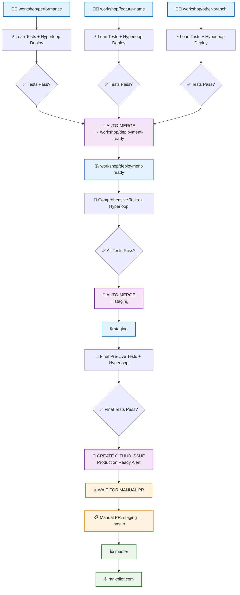

# 🚀 Complete Auto-Merge Pipeline - IMPLEMENTED
*Created: July 27, 2025*

## 🎯 **AUTO-MERGE PIPELINE FLOW**



## 📋 **PIPELINE STAGES**

### **🔬 Stage 1: Workshop Development (Auto)**
- **Branches:** `workshop/performance`, `workshop/feature-name`, etc.
- **Tests:** Lean basic tests + Hyperloop deployment
- **Duration:** ~5-15 minutes
- **On Success:** Auto-merge to `workshop/deployment-ready`

### **🏗️ Stage 2: Deployment Readiness (Auto)**
- **Branch:** `workshop/deployment-ready`
- **Tests:** Comprehensive tests + Infrastructure validation
- **Duration:** ~20-30 minutes
- **On Success:** Auto-merge to `staging`

### **🔒 Stage 3: Final Pre-Live Validation (Auto)**
- **Branch:** `staging`
- **Tests:** Production-level security + Quality assurance
- **Duration:** ~45-60 minutes
- **On Success:** Create GitHub issue alert for production PR

### **🏭 Stage 4: Production Deployment (Manual)**
- **Branch:** `master` (PR only)
- **Tests:** Health checks + Monitoring
- **Duration:** ~15-20 minutes
- **Trigger:** Manual PR approval required

---

## ⚡ **WORKFLOW FILES CREATED**

### **1. workshop-auto-merge.yml**
```yaml
# Triggers: On successful workshop/* workflows
# Action: Auto-merge successful workshop branches → deployment-ready
# Next: Triggers comprehensive testing
```

### **2. deployment-ready-auto-staging.yml**  
```yaml
# Triggers: On successful deployment-ready workflow
# Action: Auto-merge deployment-ready → staging
# Next: Triggers final pre-live validation
```

### **3. staging-success-pr-alert.yml**
```yaml
# Triggers: On successful staging workflow
# Action: Creates GitHub issue with production readiness alert
# Next: Waits for manual PR creation
```

---

## 🎯 **DEVELOPER EXPERIENCE**

### **✅ What's Automated**
1. **Workshop Testing:** Push to any workshop branch → automatic testing
2. **Auto-Promotion:** Successful tests → auto-merge to next stage
3. **Comprehensive Validation:** Full test suite at each stage
4. **Production Alerts:** Automatic notification when ready for production
5. **Quick Issue Resolution:** Hyperloop available at each stage

### **🛡️ What Requires Manual Approval**
1. **Production Deployment:** Manual PR required for `staging → master`
2. **Emergency Fixes:** Can use hyperloop at any stage for quick fixes
3. **Release Coordination:** Human oversight for production timing

---

## 📊 **PIPELINE COMMANDS**

### **🔬 Start Development Work**
```bash
# Create and work on any feature
git checkout -b workshop/seo-optimization
git push origin workshop/seo-optimization
# → Automatically flows through entire pipeline if tests pass
```

### **🚨 Quick Fixes During Pipeline**
```bash
# Fix issues at any stage with hyperloop
git push origin workshop/deployment-ready  # Fix deployment issues
git push origin staging                     # Fix staging issues
```

### **🏭 Deploy to Production (When Alert Received)**
```bash
# After receiving GitHub issue alert
npm run production:release
# → Creates PR that requires manual approval
```

---

## 🔔 **ALERT SYSTEM**

### **GitHub Issue Alert (Automated)**
When staging passes all tests, creates issue:
```
🚨 PRODUCTION READY: Create PR staging → master (2025-07-27)

✅ All automated pipelines successful
✅ Workshop → deployment-ready (auto-merged)
✅ Deployment-ready → staging (auto-merged)  
✅ Final pre-live validation complete

ACTION REQUIRED: Create PR for production deployment
```

### **Slack Notification (Optional)**
```bash
📱 PRODUCTION READY: staging → master PR needed
✅ All automated pipelines successful
⏳ Manual approval required for production deployment
```

---

## 🎯 **BENEFITS ACHIEVED**

### **🚀 Speed**
- Lean tests for rapid development feedback
- Hyperloop deployment for instant previews
- Auto-merging eliminates manual promotion delays

### **🛡️ Safety**
- Comprehensive testing at deployment-ready stage
- Production-level validation at staging
- Manual approval gate for production

### **🔧 Flexibility**
- Hyperloop available at every stage for quick fixes
- Can work on multiple workshop branches simultaneously
- Emergency fixes can bypass normal flow if needed

### **📊 Visibility**
- Clear pipeline status at each stage
- Automated alerts when ready for production
- Full audit trail of what gets promoted when

---

## ✅ **IMPLEMENTATION STATUS**

- ✅ **workshop-auto-merge.yml** - Auto-merge successful workshop branches
- ✅ **deployment-ready-auto-staging.yml** - Auto-merge to staging after comprehensive tests
- ✅ **staging-success-pr-alert.yml** - Production readiness alerts
- ✅ **Complete pipeline flow** - Workshop → deployment-ready → staging → master (PR)
- ✅ **Hyperloop integration** - Quick fixes available at each stage
- ✅ **Automated testing** - Appropriate test level for each stage

**Result: Fully automated CI/CD pipeline with human oversight for production deployment!** 🎯
