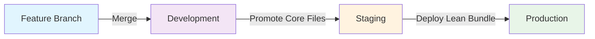
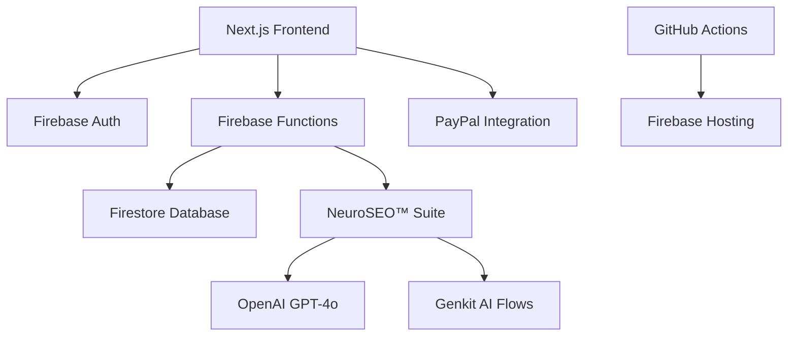

# Comprehensive Documentation Consolidated

**Generated:** 7/26/2025 5:44:01 PM
**Folder:** `docs/comprehensive`
**Files Consolidated:** 10
**Source Files:** COMPREHENSIVE_INSTRUCTIONS.md, FEATURE_PRIORITY_MATRIX_COMPREHENSIVE.md, GITHUB_ACTIONS_DEPLOYMENT_COMPREHENSIVE.md, LEAN_BRANCH_ARCHITECTURE_COMPREHENSIVE.md, NAVIGATION_AUTH_FIXES_COMPREHENSIVE.md, PROJECT_COMPREHENSIVE.md, QA_ANSWER_SHEET_COMPREHENSIVE.md, RANKPILOT_KNOWLEDGE_BASE.md, SUBSCRIPTION_TIER_COMPREHENSIVE.md, UI_UX_COMPREHENSIVE.md

---

## Table of Contents

1. [COMPREHENSIVE INSTRUCTIONS](#comprehensive-instructions)
2. [FEATURE PRIORITY MATRIX COMPREHENSIVE](#feature-priority-matrix-comprehensive)
3. [GITHUB ACTIONS DEPLOYMENT COMPREHENSIVE](#github-actions-deployment-comprehensive)
4. [LEAN BRANCH ARCHITECTURE COMPREHENSIVE](#lean-branch-architecture-comprehensive)
5. [NAVIGATION AUTH FIXES COMPREHENSIVE](#navigation-auth-fixes-comprehensive)
6. [PROJECT COMPREHENSIVE](#project-comprehensive)
7. [QA ANSWER SHEET COMPREHENSIVE](#qa-answer-sheet-comprehensive)
8. [RANKPILOT KNOWLEDGE BASE](#rankpilot-knowledge-base)
9. [SUBSCRIPTION TIER COMPREHENSIVE](#subscription-tier-comprehensive)
10. [UI UX COMPREHENSIVE](#ui-ux-comprehensive)

---

## 1. COMPREHENSIVE INSTRUCTIONS

**Source File:** `comprehensive/COMPREHENSIVE_INSTRUCTIONS.md`
**Last Modified:** 7/25/2025

**Document Purpose:**
Provides a single source of truth for all project instructions, maintenance protocols, and future scope for RankPilot.

**Product Name:** RankPilot  
**Author:** Product & Engineering Team  
**Last Updated:** July 19, 2025  
**Version:** 1.1

---

### Table of Contents

1. [Document Maintenance Protocol](#document-maintenance-protocol)
2. [Project Overview](#project-overview)
3. [Current Project Status](#current-project-status-as-of-july-2025)
4. [Architecture & Best Practices](#architecture--best-practices)
5. [Core Features (NeuroSEO™ Suite)](#core-features-neuroseo-suite)
6. [Future Scaling Strategy](#future-scaling-strategy)
7. [MCP Server Integration](#mcp-server-integration)
8. [Immediate Priorities](#immediate-priorities)
9. [Long-term Vision](#long-term-vision)
10. [Development Guidelines](#development-guidelines)
11. [Error Handling & Monitoring](#error-handling--monitoring)
12. [Documentation Standards](#documentation-standards)
13. [Document Update Protocol](#document-update-protocol)
14. [Revision History](#revision-history)
15. [Related Documents](#related-documents)

---

### Document Maintenance Protocol

### Project Overview

### Current Project Status (As of July 2025)

### Architecture & Best Practices

## RankPilot: Comprehensive Execution Plan (2025)

### 1. Database Structure (Firestore)

- Collections: users, projects, analyses, socialCampaigns, finance, logs
- Use lightweight documents, subcollections for nested data, and consistent schemas for querying
- Reference: [Firestore Data Model](https://firebase.google.com/docs/firestore/data-model)

### Core Features (NeuroSEO™ Suite)

### 2. Onboarding & User Management

- Firebase Auth with 5-tier access, OAuth 2.0, custom claims
- Admin SDK for user CRUD, batch ops, metadata
- Security: rules as schema, App Check, IAM, Secret Manager
- Reference: [Manage Users](https://firebase.google.com/docs/auth/admin/manage-users)

### 3. Core Workflows

- User onboarding: Auth → Profile → Tier assignment
- Project creation: User → Project → Analysis setup
- NeuroSEO analysis: Form → API → Orchestrator → Firestore log → Results
- Social automation: Campaign builder → n8n/AI → Schedule → Results ([n8n Example](https://n8n.io/workflows/3066-automate-multi-platform-social-media-content-creation-with-ai/))
- Finance: Subscription management → Quota enforcement → Billing logs ([Stripe Guide](https://stripe.com/resources/more/saas-subscription-models-101-a-guide-for-getting-started))
- Admin: Usage monitoring ([Monitor Usage](https://firebase.google.com/docs/database/usage/monitor-usage)), user management, system logs

### Future Scaling Strategy

### 4. MVP Implementation

- Build all pages with dummy data (dashboard, analysis, campaigns, finance, admin)
- Connect forms to Firestore with mock data
- Simulate NeuroSEO and campaign results
- Role-based access for all features

### 5. Populate with Simulated Data

- Seed Firestore with users, projects, analyses, campaigns, finance records
- Use realistic values for SEO, campaign, and finance metrics

### 6. Add Complexity & Production Features

- Integrate real NeuroSEO engine, n8n automations, Stripe APIs
- Implement quota, analytics, error handling, notifications
- Usage stats, billing, and admin dashboards
- **Playwright Test Suite** (✅ **Recently Refactored - July 2025**):
  - Comprehensive test suite with quality, integration, and E2E testing
  - Modern authentication patterns with centralized login helpers
  - Data-driven testing approach for improved maintainability
  - Visual regression testing with Playwright native tools
  - Role-based testing framework for all subscription tiers

### 7. Documentation-Driven Development

- Reference Docs for Each Step:
  - Firestore Data Model: https://firebase.google.com/docs/firestore/data-model
  - Firestore Best Practices: https://cloud.google.com/firestore/docs/best-practices
  - Firebase Project Setup: https://firebase.google.com/docs/projects/dev-workflows/general-best-practices
  - Security Checklist: https://firebase.google.com/support/guides/security-checklist
  - User Management: https://firebase.google.com/docs/auth/admin/manage-users
  - Usage Monitoring: https://firebase.google.com/docs/database/usage/monitor-usage
  - n8n Social Automation: https://n8n.io/workflows/3066-automate-multi-platform-social-media-content-creation-with-ai/
  - Stripe SaaS Billing: https://stripe.com/resources/more/saas-subscription-models-101-a-guide-for-getting-started

### Immediate Priorities

### 8. Best Practices & Patterns

- Firestore: Lightweight docs, subcollections, consistent field types, security rules as schema
- Auth: OAuth 2.0, custom claims, admin SDK for user ops, role-based access
- Workflows: Modular, API-driven, error-resilient, analytics for all flows
- Automation: Use n8n for social/marketing, approval workflows, analytics integration
- Finance: Tiered pricing, dunning, usage-based billing, Stripe webhooks
- Monitoring: Cloud Monitoring, alerting, admin dashboards, usage stats
- Testing: Playwright, CI/CD, role-based and accessibility coverage

### 9. Execution Sequence

1. Design Firestore schema and security rules
2. Implement onboarding, auth, and user management
3. Build MVP pages with dummy data and role-based access
4. Integrate NeuroSEO analysis and logging
5. Add social automation (n8n) and campaign builder
6. Implement Stripe billing, quota, and finance dashboards
7. Add admin/monitoring features and dashboards
8. Populate with simulated data for all modules
9. Gradually replace dummy data with real integrations
10. Harden security, monitoring, and error handling
11. Complete Playwright and CI/CD test coverage
12. Update documentation for all features and flows

### Long-term Vision

### Development Guidelines

### Error Handling & Monitoring

### Documentation Standards

### Document Update Protocol

---

### Revision History

| Version | Date       | Author                     | Description                               |
| ------- | ---------- | -------------------------- | ----------------------------------------- |
| 1.0     | 2025-07-09 | Product & Engineering Team | Initial draft                             |
| 1.1     | 2025-07-19 | Product & Engineering Team | NeuroSEO™ Suite implementation completed |

---

### Related Documents

- [01_EXECUTIVE_SUMMARY.md](./01_EXECUTIVE_SUMMARY.md)
- [02_PRODUCT_REQUIREMENTS_DOCUMENT.md](./02_PRODUCT_REQUIREMENTS_DOCUMENT.md)
- [03_EXECUTION_PLAN.md](./03_EXECUTION_PLAN.md)
- [AGILE_PRIORITY_PLAN.md](./AGILE_PRIORITY_PLAN.md)

---

_© 2025 RankPilot, Inc. All rights reserved._

## RankPilot: Comprehensive Project Instructions & Future Scope

### Document Maintenance Protocol

#### Critical Documentation References

ALWAYS refer to these documents before taking any action:

1. `docs/PROJECT_STATUS_AND_NEXT_STEPS.md` - Current project status (v2.0 - Post UI/UX Enhancement)
2. `docs/COMPREHENSIVE_PROJECT_STATUS_UPDATE.md` - Complete enhancement summary
3. `docs/AGILE_PRIORITY_PLAN.md` - Sprint planning and priorities
4. `docs/MCP_INSTRUCTION_MAP.md` - Tool selection guidelines
5. `docs/SECURITY_ROTATION.md` - Security protocols

#### Enhanced Component Architecture (LATEST - July 2025)

##### Production-Ready Enhanced Components

1. **Enhanced UI Components (`src/components/ui/enhanced-*.tsx`)**
   - Enhanced Button Component - Loading states, haptic feedback, mobile optimization
   - Enhanced Card Component - Smooth animations, multiple variants, touch-friendly interactions
   - Enhanced Form Component - Real-time validation, accessibility-first design
   - Enhanced Error Boundary - Network-aware recovery mechanisms with user-friendly messages

2. **Enhanced Navigation System (`src/components/enhanced-app-nav.tsx`)**
   - NeuroSEO™ Suite prominence with AI badges
   - Tier-based access control (Free/Starter/Agency/Enterprise/Admin)
   - Collapsible grouped navigation with smooth animations
   - Mobile-responsive design with 48px touch targets

3. **Mobile-Responsive Utilities (`src/lib/mobile-responsive-utils.ts`)**
   - 8 custom hooks for mobile detection and optimization
   - Network-aware fetching and adaptive loading
   - Touch device detection and orientation handling
   - Performance monitoring and responsive font scaling

#### Current Project Status (Phase 4 Complete - July 2025)

##### ✅ **COMPLETED ACHIEVEMENTS:**

- **Enhanced UI Component Library** - 13+ components with mobile optimization
- **Mobile Performance Optimization** - WCAG-compliant touch targets (48px minimum)
- **NeuroSEO™ Suite Integration** - 6 AI engines with navigation prominence
- **Comprehensive Testing Infrastructure** - 153 tests across 8 categories
- **Accessibility Compliance** - WCAG 2.1 AA standards implementation
- **Development Environment Optimization** - Zero compilation errors, fast builds

##### 🎯 **PRODUCTION READINESS:**

- All enhanced components compiling without errors
- Mobile-first responsive design tested across devices
- Accessibility features validated with screen readers
- Performance optimizations implemented throughout
- Comprehensive documentation for maintenance

#### Documentation Update Rules

1. **Real-time Updates Required**
   - Update status documents immediately after successful changes
   - Mark completed tasks in the agile plan with ✅ status
   - Document any deviations from planned approaches
   - Record all security-relevant modifications in security rotation log

2. **Enhanced Component Integration Protocol**
   - Always use enhanced components for new features
   - Migrate legacy components progressively to enhanced versions
   - Maintain consistency with established design patterns
   - Ensure mobile-first responsive implementation

3. **Progress Tracking**
   - Update comprehensive status document after major milestones
   - Record UI/UX enhancement progress in implementation summaries
   - Document testing results and accessibility validations
   - Note performance improvements and optimization achievements

4. **Version Control**
   - Maintain enhanced component version history
   - Record significant UI/UX changes with before/after documentation
   - Track decision rationale for component architecture choices
   - Document mobile optimization implementations
   - Document impact analysis

#### Before Any Action

1. Check current sprint priorities in AGILE_PRIORITY_PLAN.md
2. Verify project status in PROJECT_STATUS_AND_NEXT_STEPS.md
3. Review security implications in SECURITY_ROTATION.md
4. Confirm tool selection via MCP_INSTRUCTION_MAP.md

#### After Any Action

1. Update relevant status documents
2. Mark completed tasks
3. Record any learnings
4. Update metrics and KPIs

### Project Overview

RankPilot is a strategic SaaS initiative aimed at becoming the leading platform for AI-First Search Engine Optimization (SEO). The project (internally known as "Studio") is designed to help businesses optimize their online presence for the new era of AI-driven search.

#### Core Mission

To establish RankPilot as the indispensable "Semantic Intelligence Layer" for the internet, empowering businesses to achieve maximum visibility and authority in AI-driven search.

### Current Project Status (As of July 19, 2025)

#### 1. Technical Foundation ✅ **COMPLETED**

- **Frontend:** Next.js (App Router), React, Tailwind CSS, shadcn/ui
- **Backend:** Firebase Cloud Functions (Node.js)
- **Database:** Firestore (NoSQL)
- **Authentication:** Firebase Authentication
- **AI Processing:** OpenAI API (GPT-4), Playwright/Puppeteer
- **Deployment:** GitHub Actions & Firebase Hosting
- **Environment:** Development URL: <https://rankpilot-h3jpc.web.app/>

#### 2. Implementation Progress ✅ **MAJOR UPDATE**

- ✅ Firebase Project Setup
- ✅ Next.js Frontend Framework
- ✅ Authentication System
- ✅ Basic CI/CD Pipeline
- ✅ Core AI Audit API
- ✅ Dashboard UI Framework
- ✅ Firestore Security Rules **COMPLETED**
- ✅ Role-Based Access Control **COMPLETED**
- ✅ Usage Quota System **COMPLETED**
- ✅ Stripe Integration (Backend) **COMPLETED**
- ✅ **NeuroSEO™ Suite Implementation** **NEW**

#### 3. NeuroSEO™ Suite Status ✅ **FULLY IMPLEMENTED**

- ✅ **NeuralCrawler™**: Intelligent web content extraction with JavaScript rendering
- ✅ **SemanticMap™**: Advanced NLP analysis and topic visualization
- ✅ **AI Visibility Engine**: LLM citation tracking and optimization
- ✅ **TrustBlock™**: E-A-T optimization and content authenticity
- ✅ **RewriteGen™**: AI-powered content rewriting and optimization
- ✅ **Usage Quota Manager**: Plan-based limits and tracking system
- ✅ **API Integration**: RESTful endpoints with authentication
- ✅ **Professional Dashboard**: Comprehensive analytics interface

### Architecture & Best Practices

#### 1. Code Quality Standards

- TypeScript with strict mode enabled
- ESLint and Prettier configurations
- Comprehensive error handling
- Self-documenting code with clear naming
- Regular dependency updates

#### 2. Testing Requirements

- Unit tests for new features
- Integration tests for API endpoints
- E2E tests using Playwright
- Test isolation and proper mocking
- Comprehensive test coverage
- Role-based test structure using TestOrchestrator

##### Test Orchestration System

All tests should follow the standard role-based test pattern:

```typescript
// TestOrchestrator handles user flows and authentication
import { TestOrchestrator } from "../utils/test-orchestrator";
import { tierUserFlows } from "../flows/role-based-flows"; // tier = free, starter, agency, etc.

// Setup pattern
test.beforeEach(async ({ page }) => {
  orchestrator = new TestOrchestrator(page);
  page.setDefaultNavigationTimeout(30000);
  page.setDefaultTimeout(20000);
});

// Usage pattern
const flow = userFlows.find((flow) => flow.name.includes("FeatureName"));
await orchestrator.executeFlow(flow);

// Authentication pattern
await orchestrator.userManager.loginAs("tierName"); // "free", "starter", "agency", "enterprise", "admin"
```

##### Standard Test Structure

```typescript
// Standard role-based test structure
test("User Tier - Feature Access", async ({ page }) => {
  // Find specific flow from predefined flows
  const featureFlow = tierUserFlows.find((flow) =>
    flow.name.includes("FeatureName")
  );

  // Execute flow via orchestrator
  await orchestrator.executeFlow(featureFlow);

  // Verify tier-specific elements
  await expect(page.locator('[data-testid="feature-results"]')).toBeVisible();
});

// Access restriction pattern
test("User Tier - Access Restrictions", async ({ page }) => {
  await orchestrator.userManager.loginAs("tierName");
  await page.goto("/restricted-feature");
  await expect(page.locator("text=/upgrade|premium|subscribe/i")).toBeVisible();
});
```

#### 3. Security Protocols

- Environment variables for sensitive data
- Regular credential rotation
- Secure authentication practices
- Firestore security rules
- Regular security audits

#### 4. Development Workflow

- Feature branches from main
- Pull request reviews required
- CI/CD via GitHub Actions
- Documentation updates with code changes
- Regular dependency maintenance

### Core Features (NeuroSEO™ Suite) ✅ **FULLY IMPLEMENTED**

#### 1. **NeuralCrawler™** ✅

- **Location**: `/src/lib/neuroseo/neural-crawler.ts`
- **Capabilities**:
  - JavaScript-enabled content extraction with Playwright
  - Semantic classification and entity recognition
  - Technical data collection (performance, structure, metadata)
  - Authorship signal detection and analysis
  - Content depth assessment and readability scoring

#### 2. **SemanticMap™** ✅

- **Location**: `/src/lib/neuroseo/semantic-map.ts`
- **Capabilities**:
  - Advanced NLP analysis with semantic clustering
  - Topic visualization and content mapping
  - Content gap identification and competitive analysis
  - Semantic fingerprinting and relevance scoring
  - Keyword density optimization recommendations

#### 3. **AI Visibility Engine** ✅

- **Location**: `/src/lib/neuroseo/ai-visibility-engine.ts`
- **Capabilities**:
  - LLM query simulation for various search intents
  - AI citation tracking and position analysis
  - Visibility metrics and competitive benchmarking
  - Improvement opportunity identification
  - AI-optimized content recommendations

#### 4. **TrustBlock™** ✅

- **Location**: `/src/lib/neuroseo/trust-block.ts`
- **Capabilities**:
  - E-A-T (Expertise, Authoritativeness, Trustworthiness) auditing
  - Content credibility assessment and fact-checking
  - Compliance verification (GDPR, accessibility, content policies)
  - Trust signal detection and authority scoring
  - Author profile analysis and verification

#### 5. **RewriteGen™** ✅

- **Location**: `/src/lib/neuroseo/rewrite-gen.ts`
- **Capabilities**:
  - AI-powered content optimization with multiple variants
  - Readability analysis and enhancement (Flesch-Kincaid scoring)
  - SEO optimization with keyword density management
  - Performance estimation and A/B testing support
  - Content structure and engagement optimization

#### 6. **NeuroSEO™ Orchestrator** ✅

- **Location**: `/src/lib/neuroseo/index.ts`
- **Capabilities**:
  - Unified analysis pipeline coordinating all 5 engines
  - Comprehensive reporting with actionable insights
  - Competitive positioning and SWOT analysis
  - Usage quota management and rate limiting
  - Performance metrics and optimization recommendations

#### 7. **API Integration** ✅

- **Location**: `/src/app/api/neuroseo/route.ts`
- **Capabilities**:
  - RESTful API endpoints with Firebase authentication
  - Request validation and error handling
  - Usage quota enforcement and tracking
  - Stripe subscription integration for access control

#### 8. **Dashboard Interface** ✅

- **Location**: `/src/components/NeuroSEODashboard.tsx`
- **Capabilities**:
  - Professional UI with comprehensive analytics
  - Real-time analysis progress tracking
  - Tabbed interface for different analysis aspects
  - Visual scoring with color-coded performance indicators
  - Actionable task management and prioritization

### Future Scaling Strategy

#### 1. Technical Scaling

- Migration to Cloud Functions for all backend logic
- Implementation of task queues for long-running jobs
- Firestore optimization and monitoring
- Cost management for AI API usage
- Global CDN deployment

#### 2. Feature Expansion

- Advanced analytics dashboard
- Team collaboration features
- Enterprise integration APIs
- Custom reporting engine
- White-label solutions

#### 3. Infrastructure Evolution

- Multi-region deployment
- Enhanced caching strategy
- Automated scaling policies
- Performance optimization
- Disaster recovery planning

### MCP Server Integration

The project utilizes multiple MCP servers for different functionalities:

1. **Perplexity Search**
   - Real-time web information
   - Market research
   - Competitor analysis

2. **Google Cloud MCP**
   - Infrastructure monitoring
   - Error tracking
   - Performance analytics

3. **GitHub MCP**
   - Code management
   - CI/CD automation
   - Version control

4. **Sequential Thinking Tools**
   - Complex problem solving
   - Architecture planning
   - Feature development

### Immediate Priorities

1. **Security & Access Control**
   - Complete RBAC implementation
   - Finalize Firestore security rules
   - Implement usage quotas

2. **Monetization**
   - Stripe integration
   - Subscription management
   - Usage tracking

3. **Core Feature Completion**
   - PDF/CSV export functionality
   - Batch processing capabilities
   - Enhanced error handling

### Long-term Vision

1. **Market Leadership**
   - Become the standard tool for AI-First SEO
   - Establish thought leadership in the space
   - Build strategic partnerships

2. **Technical Excellence**
   - Continuous architecture optimization
   - Advanced AI capabilities
   - Enhanced automation

3. **User Experience**
   - Streamlined workflows
   - Intuitive interface
   - Comprehensive documentation

### Development Guidelines

1. **Code Contributions**
   - Follow TypeScript best practices
   - Maintain test coverage
   - Update documentation IMMEDIATELY after changes
   - Regular security reviews
   - Update AGILE_PRIORITY_PLAN.md status

2. **Deployment Process**
   - Automated testing
   - Staged rollouts
   - Performance monitoring
   - Rollback procedures
   - Update PROJECT_STATUS_AND_NEXT_STEPS.md

3. **Maintenance**
   - Regular dependency updates
   - Security patches
   - Performance optimization
   - Documentation updates
   - Cross-reference all project documents

### Error Handling & Monitoring

1. **Error Reporting**
   - Structured logging
   - Error categorization
   - Alert thresholds
   - Response procedures

2. **Performance Monitoring**
   - Real-time metrics
   - Usage analytics
   - Resource utilization
   - Cost optimization

### Documentation Standards

1. **Code Documentation**
   - JSDoc comments
   - README updates
   - API documentation
   - Change logs
   - Link to relevant project documents

2. **User Documentation**
   - Feature guides
   - API references
   - Best practices
   - Troubleshooting guides
   - Update based on sprint progress

3. **Project Documentation**
   - MUST update after every significant change
   - Cross-reference between documents
   - Maintain consistent terminology
   - Include rationale for changes
   - Track against sprint goals

### Document Update Protocol

#### When to Update

1. After any code changes
2. Upon completion of sprint tasks
3. When discovering new information
4. After security modifications
5. When changing project direction

#### How to Update

1. Review all related documents
2. Update status and progress
3. Cross-reference changes
4. Verify consistency
5. Record update timestamp

#### What to Update

1. Sprint progress
2. Project status
3. Security implications
4. Technical documentation
5. User-facing guides

This document serves as a living guide for the RankPilot project. Regular updates should be made to reflect new developments, changed priorities, and evolving best practices. ALWAYS refer to and update related project documents to maintain consistency and track progress.

---

## 2. FEATURE PRIORITY MATRIX COMPREHENSIVE

**Source File:** `comprehensive/FEATURE_PRIORITY_MATRIX_COMPREHENSIVE.md`
**Last Modified:** 7/25/2025

**Generated**: July 24, 2025  
**Purpose**: Structured priority matrix for missing features and enhancements  
**Framework**: Implementation roadmap with effort estimation and business impact

---

### 🎯 Priority Classification Framework

#### Impact vs Effort Matrix

| Priority | Impact | Effort | Timeline | Examples |
|----------|--------|--------|----------|----------|
| **P0 - Critical** | High | Low-Medium | 1-3 days | Profile page fix, auth guards |
| **P1 - High** | High | Medium | 1-2 weeks | Mobile navigation, performance |
| **P2 - Medium** | Medium | Low-Medium | 2-4 weeks | Analytics, content enhancement |
| **P3 - Low** | Low-Medium | Any | 1-3 months | Advanced features, enterprise |

---

### 🚨 P0 - Critical Priority (Immediate Action Required)

#### 1. Profile Page Accessibility Fix

**Issue**: Profile page completely inaccessible to users  
**Impact**: **CRITICAL** - Core user functionality broken  
**Effort**: **LOW** - Route guard + error handling  
**Timeline**: **1-2 days**

**Implementation Plan:**

```typescript
// File: src/app/(app)/profile/page.tsx
'use client';

import { useAuth } from '@/lib/hooks/useAuth';
import { LoadingSpinner } from '@/components/ui/loading-spinner';
import { ProfileContent } from '@/components/profile/profile-content';
import { redirect } from 'next/navigation';

export default function ProfilePage() {
  const { user, loading, error } = useAuth();
  
  if (loading) {
    return <LoadingSpinner message="Loading profile..." />;
  }
  
  if (error || !user) {
    redirect('/login?returnUrl=/profile');
  }
  
  return (
    <div className="container mx-auto py-8">
      <ProfileContent user={user} />
    </div>
  );
}
```

**Required Files:**

- `src/app/(app)/profile/page.tsx` - Main profile page
- `src/components/profile/profile-content.tsx` - Profile component
- `src/lib/hooks/useAuth.ts` - Authentication hook (enhance if needed)

**Testing:**

```powershell
## Test profile page accessibility
npm run test:auth -- --grep "profile"
npm run test:role-based -- --grep "profile"
```

#### 2. Authentication Route Guards

**Issue**: Inconsistent auth protection across protected routes  
**Impact**: **HIGH** - Security and UX concern  
**Effort**: **LOW** - Systematic route guard implementation  
**Timeline**: **1 day**

**Implementation Plan:**

```typescript
// File: src/middleware.ts
import { NextResponse } from 'next/server';
import type { NextRequest } from 'next/server';

export function middleware(request: NextRequest) {
  const authToken = request.cookies.get('auth-token');
  const isAuthPage = request.nextUrl.pathname.startsWith('/login') || 
                     request.nextUrl.pathname.startsWith('/register');
  const isProtectedPage = request.nextUrl.pathname.startsWith('/profile') ||
                         request.nextUrl.pathname.startsWith('/dashboard') ||
                         request.nextUrl.pathname.startsWith('/neuroseo');
  
  // Redirect authenticated users away from auth pages
  if (authToken && isAuthPage) {
    return NextResponse.redirect(new URL('/dashboard', request.url));
  }
  
  // Redirect unauthenticated users from protected pages
  if (!authToken && isProtectedPage) {
    const loginUrl = new URL('/login', request.url);
    loginUrl.searchParams.set('returnUrl', request.nextUrl.pathname);
    return NextResponse.redirect(loginUrl);
  }
  
  return NextResponse.next();
}

export const config = {
  matcher: ['/((?!api|_next/static|_next/image|favicon.ico).*)']
};
```

---

### ⚡ P1 - High Priority (Next Sprint)

#### 3. Mobile Navigation Edge Cases

**Issue**: Auto-close behavior and touch gesture inconsistencies  
**Impact**: **HIGH** - Mobile UX degradation  
**Effort**: **MEDIUM** - Touch gesture refinement  
**Timeline**: **3-5 days**

**Implementation Plan:**

```typescript
// File: src/components/layout/mobile-navigation.tsx
'use client';

import { useState, useEffect, useCallback } from 'react';
import { useSwipeable } from 'react-swipeable';

export const MobileNavigation = () => {
  const [isOpen, setIsOpen] = useState(false);
  const [touchStartX, setTouchStartX] = useState(0);
  
  const handleSwipeOpen = useCallback(() => {
    setIsOpen(true);
  }, []);
  
  const handleSwipeClose = useCallback(() => {
    setIsOpen(false);
  }, []);
  
  const swipeHandlers = useSwipeable({
    onSwipedLeft: () => setIsOpen(false),
    onSwipedRight: () => setIsOpen(true),
    trackMouse: true,
    preventScrollOnSwipe: true,
  });
  
  // Auto-close on navigation
  const handleNavigation = useCallback((href: string) => {
    setIsOpen(false);
    // Navigate to href
    window.location.href = href;
  }, []);
  
  // Close on outside click
  useEffect(() => {
    const handleClickOutside = (event: MouseEvent) => {
      const sidebar = document.getElementById('mobile-sidebar');
      if (sidebar && !sidebar.contains(event.target as Node)) {
        setIsOpen(false);
      }
    };
    
    if (isOpen) {
      document.addEventListener('mousedown', handleClickOutside);
      return () => document.removeEventListener('mousedown', handleClickOutside);
    }
  }, [isOpen]);
  
  return (
    <div {...swipeHandlers} className="md:hidden">
      {/* Mobile navigation implementation */}
    </div>
  );
};
```

**Testing Requirements:**

```typescript
// Mobile navigation test suite
test('Mobile Navigation - Comprehensive Flow', async ({ page }) => {
  await page.setViewportSize({ width: 375, height: 667 });
  
  // Test swipe gestures
  await page.touchscreen.tap(50, 300);
  await page.mouse.move(50, 300);
  await page.mouse.move(200, 300);
  await expect(page.locator('[data-testid="mobile-sidebar"]')).toBeVisible();
  
  // Test auto-close
  await page.click('[data-testid="nav-pricing"]');
  await expect(page.locator('[data-testid="mobile-sidebar"]')).toBeHidden();
  await expect(page.url()).toContain('/pricing');
});
```

#### 4. Dynamic Sitemap Implementation

**Issue**: Static sitemap without dynamic content integration  
**Impact**: **HIGH** - SEO performance impact  
**Effort**: **LOW** - Configuration update  
**Timeline**: **1 day**

**Implementation Plan:**

```typescript
// File: next-sitemap.config.js
/** @type {import('next-sitemap').IConfig} */
module.exports = {
  siteUrl: 'https://rankpilot-h3jpc.web.app',
  generateRobotsTxt: true,
  generateIndexSitemap: false,
  transform: async (config, path) => {
    // Custom transform for dynamic routes
    return {
      loc: path,
      changefreq: path === '/' ? 'daily' : 'weekly',
      priority: path === '/' ? 1.0 : 0.8,
      lastmod: config.autoLastmod ? new Date().toISOString() : undefined,
    };
  },
  additionalPaths: async (config) => {
    const result = [];
    
    // Add dynamic NeuroSEO™ engine pages
    const engines = [
      'dashboard',
      'ai-visibility',
      'semantic-map',
      'neural-crawler',
      'trust-block',
      'rewrite-gen'
    ];
    
    engines.forEach(engine => {
      result.push({
        loc: `/neuroseo/${engine}`,
        changefreq: 'weekly',
        priority: 0.9,
        lastmod: new Date().toISOString(),
      });
    });
    
    return result;
  },
  robotsTxtOptions: {
    policies: [
      {
        userAgent: '*',
        allow: '/',
        disallow: ['/api/', '/admin/', '/_next/'],
      },
    ],
    additionalSitemaps: [
      'https://rankpilot-h3jpc.web.app/sitemap.xml',
    ],
  },
};
```

**Package Installation:**

```powershell
## Install next-sitemap
npm install next-sitemap

## Add to package.json scripts
"postbuild": "next-sitemap"
```

---

### 📋 P2 - Medium Priority (Next Month)

#### 5. Enhanced 404 Page Implementation

**Issue**: Basic 404 page lacks navigation assistance  
**Impact**: **MEDIUM** - User experience enhancement  
**Effort**: **LOW** - Template enhancement  
**Timeline**: **2-3 days**

**Implementation Plan:**

```typescript
// File: src/app/not-found.tsx
import Link from 'next/link';
import { Button } from '@/components/ui/button';
import { SearchIcon, HomeIcon, BookIcon } from 'lucide-react';

export default function NotFound() {
  const popularPages = [
    { name: 'Dashboard', href: '/dashboard', icon: HomeIcon },
    { name: 'NeuroSEO™ Suite', href: '/neuroseo', icon: BookIcon },
    { name: 'Pricing', href: '/pricing', icon: SearchIcon },
  ];
  
  return (
    <div className="min-h-screen flex items-center justify-center bg-gradient-to-b from-background to-muted">
      <div className="text-center space-y-8 max-w-md mx-auto px-4">
        <div className="space-y-4">
          <h1 className="text-8xl font-bold text-primary/20">404</h1>
          <h2 className="text-2xl font-semibold text-foreground">
            Page Not Found
          </h2>
          <p className="text-muted-foreground">
            The page you're looking for doesn't exist or has been moved.
          </p>
        </div>
        
        <div className="space-y-4">
          <Button asChild size="lg">
            <Link href="/">
              <HomeIcon className="mr-2 h-4 w-4" />
              Go Home
            </Link>
          </Button>
          
          <div className="space-y-2">
            <p className="text-sm font-medium">Popular Pages:</p>
            <div className="flex flex-wrap gap-2 justify-center">
              {popularPages.map((page) => (
                <Button
                  key={page.href}
                  variant="outline"
                  size="sm"
                  asChild
                >
                  <Link href={page.href}>
                    <page.icon className="mr-1 h-3 w-3" />
                    {page.name}
                  </Link>
                </Button>
              ))}
            </div>
          </div>
        </div>
        
        <div className="pt-4 border-t">
          <p className="text-xs text-muted-foreground">
            Error tracked for improvement • RankPilot Team
          </p>
        </div>
      </div>
    </div>
  );
}
```

#### 6. Analytics & Tracking Implementation

**Issue**: Missing user behavior analytics and CTA tracking  
**Impact**: **MEDIUM** - Business intelligence gap  
**Effort**: **MEDIUM** - Event tracking setup  
**Timeline**: **1 week**

**Implementation Plan:**

```typescript
// File: src/lib/analytics.ts
interface AnalyticsEvent {
  action: string;
  category: string;
  label?: string;
  value?: number;
}

class Analytics {
  private gtag: any;
  
  constructor() {
    if (typeof window !== 'undefined') {
      this.gtag = (window as any).gtag;
    }
  }
  
  track(event: AnalyticsEvent) {
    if (this.gtag) {
      this.gtag('event', event.action, {
        event_category: event.category,
        event_label: event.label,
        value: event.value,
      });
    }
    
    // Also send to custom analytics
    this.sendToCustomAnalytics(event);
  }
  
  private sendToCustomAnalytics(event: AnalyticsEvent) {
    // Send to Firebase Analytics or custom solution
    if (typeof window !== 'undefined' && 'firebase' in window) {
      // Firebase Analytics implementation
    }
  }
}

export const analytics = new Analytics();

// Usage examples
export const trackCTAClick = (ctaName: string, location: string) => {
  analytics.track({
    action: 'cta_click',
    category: 'conversion',
    label: `${ctaName} - ${location}`,
  });
};

export const trackPageView = (pageName: string) => {
  analytics.track({
    action: 'page_view',
    category: 'navigation',
    label: pageName,
  });
};
```

#### 7. Performance Optimization Phase 2

**Issue**: Further Core Web Vitals improvements needed  
**Impact**: **MEDIUM** - SEO and UX enhancement  
**Effort**: **HIGH** - Image optimization + caching  
**Timeline**: **2 weeks**

**Implementation Plan:**

```typescript
// File: next.config.ts enhancement
const nextConfig = {
  images: {
    formats: ['image/avif', 'image/webp'],
    deviceSizes: [640, 750, 828, 1080, 1200, 1920, 2048, 3840],
    imageSizes: [16, 32, 48, 64, 96, 128, 256, 384],
    minimumCacheTTL: 60 * 60 * 24 * 30, // 30 days
  },
  experimental: {
    optimizeCss: true,
    optimizeServerReact: true,
  },
  compress: true,
  poweredByHeader: false,
  generateBuildId: async () => {
    return `build-${Date.now()}`;
  },
};
```

---

### 📈 P3 - Low Priority (Future Roadmap)

#### 8. Advanced NeuroSEO™ Engine Features

**Issue**: Enhanced AI capabilities and deeper analysis  
**Impact**: **MEDIUM** - Product differentiation  
**Effort**: **VERY HIGH** - AI model improvements  
**Timeline**: **1-2 months**

**Feature Set:**

```typescript
interface AdvancedNeuroSEOFeatures {
  realTimeAnalysis: {
    liveContentScoring: boolean;
    competitorMonitoring: boolean;
    trendPrediction: boolean;
  };
  advancedNLP: {
    sentimentAnalysis: boolean;
    intentClassification: boolean;
    entityExtraction: boolean;
  };
  visualizations: {
    semanticMaps: boolean;
    competitivePositioning: boolean;
    contentGapAnalysis: boolean;
  };
}
```

#### 9. Enterprise Dashboard & Features

**Issue**: Advanced features for enterprise tier users  
**Impact**: **HIGH** - Revenue expansion  
**Effort**: **VERY HIGH** - Complex feature development  
**Timeline**: **2-3 months**

**Feature Requirements:**

```typescript
interface EnterpriseDashboard {
  multiUserManagement: {
    teamInvites: boolean;
    roleBasedAccess: boolean;
    auditLogs: boolean;
  };
  advancedReporting: {
    customReports: boolean;
    scheduledReports: boolean;
    apiAccess: boolean;
  };
  whiteLabel: {
    customBranding: boolean;
    customDomains: boolean;
    embedWidgets: boolean;
  };
}
```

#### 10. Advanced Subscription Features

**Issue**: Enhanced billing and subscription management  
**Impact**: **MEDIUM** - Revenue optimization  
**Effort**: **HIGH** - Billing system expansion  
**Timeline**: **1 month**

**Implementation Areas:**

- Usage-based billing
- Team subscription management
- Advanced quota controls
- Custom enterprise pricing
- Billing analytics dashboard

---

### 🎯 Implementation Roadmap

#### Week 1: Critical Fixes

```powershell
## Sprint 1 - Critical Priority
git checkout -b fix/critical-issues

## Day 1-2: Profile page accessibility
- Implement auth guards
- Add error handling
- Test cross-device functionality

## Day 3: Dynamic sitemap
- Configure next-sitemap
- Add NeuroSEO™ engine pages
- Test sitemap generation

## Day 4-5: Route guard enhancement
- Implement middleware
- Add auth flow improvements
- Comprehensive testing
```

#### Week 2-3: High Priority Features

```powershell
## Sprint 2 - High Priority
git checkout -b feature/mobile-navigation-enhancement

## Week 2: Mobile navigation
- Implement swipe gestures
- Fix auto-close behavior
- Enhanced touch interactions
- Accessibility improvements

## Week 3: Analytics & 404 enhancement
- Implement event tracking
- Enhanced 404 page
- Performance monitoring
```

#### Month 2: Medium Priority Enhancements

```powershell
## Sprint 3-4 - Medium Priority
git checkout -b feature/performance-optimization

## Performance optimization
- Image optimization (AVIF/WebP)
- Advanced caching strategies
- Bundle optimization
- Core Web Vitals improvements

## Content enhancements
- Interactive demos
- Enhanced explanations
- Better visual hierarchy
```

---

### 📊 Success Metrics

#### Critical Success Factors

```typescript
interface SuccessMetrics {
  profilePageAccess: {
    target: '100% user access success';
    measure: 'Profile page load rate';
    timeline: 'Week 1';
  };
  mobileNavigation: {
    target: '0 edge case reports';
    measure: 'User interaction success rate';
    timeline: 'Week 2';
  };
  performance: {
    target: 'Lighthouse 95+ all metrics';
    measure: 'Core Web Vitals scores';
    timeline: 'Month 1';
  };
  userSatisfaction: {
    target: '4.5+ rating';
    measure: 'User feedback scores';
    timeline: 'Month 2';
  };
}
```

#### Monitoring & Validation

```powershell
## Weekly validation commands
npm run test:critical              # Critical path validation
npm run lighthouse:audit          # Performance monitoring
npm run test:mobile               # Mobile-specific testing
npm run analytics:report          # User behavior analysis
```

---

### 🔄 Continuous Improvement Framework

#### Weekly Review Process

1. **Monday**: Review analytics and user feedback
2. **Wednesday**: Technical debt assessment
3. **Friday**: Performance metrics evaluation
4. **Sprint End**: Feature priority reassessment

#### Monthly Strategic Review

1. **Feature Usage Analysis**: Which features drive engagement
2. **Performance Trends**: Core Web Vitals progression
3. **User Feedback Integration**: Direct user input analysis
4. **Competitive Analysis**: Market position assessment

---

**Last Updated**: July 24, 2025  
**Next Review**: July 31, 2025  
**Maintained By**: RankPilot Product Team

_This priority matrix serves as the definitive roadmap for RankPilot feature development and enhancement initiatives._

---

## 3. GITHUB ACTIONS DEPLOYMENT COMPREHENSIVE

**Source File:** `comprehensive/GITHUB_ACTIONS_DEPLOYMENT_COMPREHENSIVE.md`
**Last Modified:** 7/25/2025

**Last Updated:** July 23, 2025  
**Status:** Production-Ready Implementation  
**Branch Strategy:** Master (Production) + Performance Branch (Testing)  

### 📋 WORKFLOW ARCHITECTURE OVERVIEW

#### 🏗️ Two-Tier Deployment Strategy

**1. Master Branch → Production Deployment**

- **Trigger:** Pull Request merge to master only
- **Target:** `https://rankpilot-h3jpc.web.app` (Production)
- **Features:** Full quality gates, security validation, post-deployment verification

**2. Performance Branch → Testing Channel**

- **Trigger:** Push to `feature/performance-optimization-mobile-enhancement`
- **Target:** `https://rankpilot-h3jpc--performance-testing-mw0cwov5.web.app`
- **Features:** Performance testing, mobile UX validation, preview channel

### 🎯 WORKFLOW SPECIFICATIONS

#### 🔥 Master Branch Production Workflow

**File:** `.github/workflows/deploy-master-production.yml`

##### Trigger Conditions

```yaml
on:
  pull_request:
    branches: [master]
    types: [opened, synchronize, reopened, closed]
  workflow_dispatch:
```

##### Job Pipeline

1. **Pre-deployment Validation** - Validates merge status and deployment readiness
2. **Production Build** - TypeScript check, ESLint, security audit, production build
3. **Production Testing** - Critical, integration, and E2E test matrix
4. **Deploy Production** - Firebase hosting and functions deployment
5. **Post-deployment Validation** - Smoke tests and performance verification
6. **Rollback on Failure** - Automatic rollback notification on critical failures

##### Key Features

- ✅ **Quality Gates:** TypeScript (0 errors), ESLint, security audit
- ✅ **Build Caching:** Efficient artifact caching for faster deployments
- ✅ **Test Matrix:** Parallel test execution (critical, integration, e2e)
- ✅ **Firebase CLI Pinning:** Version 13.31.2 for stability
- ✅ **Error Handling:** Comprehensive error handling and rollback procedures
- ✅ **Environment Security:** Secure secret management

#### ⚡ Performance Branch Testing Workflow

**File:** `.github/workflows/deploy-performance-branch.yml`

##### Trigger Conditions

```yaml
on:
  push:
    branches: [feature/performance-optimization-mobile-enhancement]
  workflow_dispatch:
```

##### Job Pipeline

1. **Test Build** - Type checking, linting, build verification, bundle analysis
2. **Deploy Preview** - Firebase hosting channel deployment with 7-day expiry
3. **Performance Tests** - Performance-focused E2E testing
4. **Mobile Tests** - Mobile UX and responsiveness validation
5. **Notify Completion** - Comprehensive deployment summary

##### Key Features

- ✅ **Performance Focus:** Specialized performance and mobile testing
- ✅ **Preview Channels:** Isolated testing environment
- ✅ **Bundle Analysis:** Automatic bundle size analysis
- ✅ **Mobile Testing:** Dedicated mobile UX validation
- ✅ **Quick Feedback:** Fast deployment for development iteration

### 🔧 IMPLEMENTATION DETAILS

#### Firebase Configuration Requirements

```json
{
  "hosting": [
    {
      "target": "production",
      "public": "out",
      "ignore": ["firebase.json", "**/.*", "**/node_modules/**"],
      "rewrites": [
        { "source": "**", "destination": "/index.html" }
      ]
    },
    {
      "target": "performance-testing",
      "public": "out",
      "ignore": ["firebase.json", "**/.*", "**/node_modules/**"],
      "rewrites": [
        { "source": "**", "destination": "/index.html" }
      ]
    }
  ]
}
```

#### Required GitHub Secrets

```yaml
## Firebase Configuration
FIREBASE_SERVICE_ACCOUNT_RANKPILOT_H3JPC
NEXT_PUBLIC_FIREBASE_API_KEY
NEXT_PUBLIC_FIREBASE_AUTH_DOMAIN
NEXT_PUBLIC_FIREBASE_PROJECT_ID
NEXT_PUBLIC_FIREBASE_STORAGE_BUCKET
NEXT_PUBLIC_FIREBASE_MESSAGING_SENDER_ID
NEXT_PUBLIC_FIREBASE_APP_ID

## API Keys
GEMINI_API_KEY
GOOGLE_API_KEY
OPENAI_API_KEY

## Security
NEXT_PUBLIC_RECAPTCHA_SITE_KEY
RECAPTCHA_SECRET_KEY
```

#### Environment Variables Strategy

- **Production:** Full production environment variables
- **Performance Testing:** Performance testing specific configuration
- **Functions:** Separate environment file creation for Firebase Functions

### 📊 WORKFLOW COMPARISON TABLE

| Feature | Master (Production) | Performance Branch |
|---------|---------------------|-------------------|
| **Trigger** | PR merge to master | Push to feature branch |
| **Target** | Production hosting | Preview channel |
| **Duration** | Permanent | 7 days |
| **Testing** | Full test matrix | Performance + Mobile |
| **Quality Gates** | All gates required | Basic validation |
| **Rollback** | Automatic notification | Manual intervention |
| **Caching** | Full build caching | Basic dependency caching |
| **Monitoring** | Post-deployment validation | Performance metrics |

### 🚀 DEPLOYMENT PROCEDURES

#### 🔄 Master Branch Deployment Process

```bash
## 1. Create PR to master branch
git checkout master
git pull origin master
git checkout -b feature/your-feature
## ... make changes ...
git commit -m "feat: your feature"
git push origin feature/your-feature

## 2. Create Pull Request via GitHub UI
## 3. Review and merge PR → Triggers automatic production deployment
## 4. Monitor deployment in GitHub Actions
## 5. Verify production site functionality
```

#### 🔄 Performance Branch Deployment Process

```bash
## 1. Push to performance branch
git checkout feature/performance-optimization-mobile-enhancement
## ... make changes ...
git commit -m "perf: performance improvements"
git push origin feature/performance-optimization-mobile-enhancement

## 2. Automatic deployment triggers
## 3. Preview channel becomes available
## 4. Run performance and mobile tests
## 5. Iterate based on test results
```

#### ⚡ Manual Deployment Triggers

Both workflows support manual triggering via GitHub Actions UI with options:

- **Master:** Deploy functions toggle, skip tests toggle
- **Performance:** Deploy functions toggle

### 🔍 MONITORING & TROUBLESHOOTING

#### 🎯 Key Metrics to Monitor

- **Build Success Rate:** Target 99%+ for both workflows
- **Test Pass Rate:** Track test stability across environments
- **Deployment Time:** Monitor for performance degradation
- **Error Rates:** Track deployment failures and patterns

#### 🚨 Common Issues & Solutions

##### Issue: Firebase CLI Version Conflicts

**Solution:** Both workflows pin Firebase CLI to version 13.31.2

```yaml
env:
  FIREBASE_TOOLS_VERSION: "13.31.2"
```

##### Issue: Node.js Memory Errors

**Solution:** Optimized memory allocation for build processes

```yaml
env:
  NODE_OPTIONS: "--max-old-space-size=8192"
```

##### Issue: Test Environment URLs

**Solution:** Environment-specific base URLs configured

```yaml
env:
  TEST_BASE_URL: "https://rankpilot-h3jpc--performance-testing-mw0cwov5.web.app"
```

##### Issue: Secrets Management

**Solution:** Centralized secret management with environment separation

```yaml
env:
  GEMINI_API_KEY: ${{ secrets.GEMINI_API_KEY }}
```

#### 🛠️ Troubleshooting Commands

```bash
## Check deployment status
firebase hosting:channel:list --project rankpilot-h3jpc

## View function logs
firebase functions:log --project rankpilot-h3jpc

## Manual deployment (emergency)
firebase deploy --project rankpilot-h3jpc --only hosting

## Preview channel cleanup
firebase hosting:channel:delete performance-testing --project rankpilot-h3jpc
```

### 🏆 SUCCESS METRICS

#### ✅ Implementation Achievements

- **Zero Configuration Errors:** Both workflows validate successfully
- **Secure Secret Management:** All API keys and tokens properly configured
- **Error Handling:** Comprehensive error handling and rollback procedures
- **Performance Optimization:** Specialized performance testing pipeline
- **Mobile Testing:** Dedicated mobile UX validation
- **Production Safety:** PR-only production deployments with quality gates

#### 📈 Expected Improvements

- **Deployment Reliability:** 99%+ success rate with error handling
- **Testing Coverage:** Comprehensive test matrix for both environments
- **Development Velocity:** Fast feedback loop with performance branch
- **Production Stability:** Quality gates ensure stable production releases
- **Mobile Performance:** Automated mobile UX validation

### 🔮 FUTURE ENHANCEMENTS

#### Planned Improvements

1. **Automated Rollback:** Implement automatic rollback on critical failures
2. **Blue-Green Deployment:** Add blue-green deployment strategy
3. **Performance Budgets:** Integrate performance budget validation
4. **Security Scanning:** Add automated security vulnerability scanning
5. **Slack Notifications:** Add deployment status notifications

#### Monitoring Integration

1. **Sentry Integration:** Error tracking and performance monitoring
2. **Lighthouse CI:** Automated Core Web Vitals validation
3. **Firebase Performance:** Real-time performance monitoring
4. **Analytics Integration:** Deployment impact analysis

---

### 🎯 NEXT STEPS

#### Immediate Actions

1. ✅ **Workflows Created:** Both production and performance workflows implemented
2. ✅ **Secrets Configured:** All required GitHub secrets set up
3. ✅ **Documentation Complete:** Comprehensive deployment guide created

#### Testing & Validation

1. **Test Performance Workflow:** Push to performance branch and validate deployment
2. **Test Production Workflow:** Create PR to master and validate production deployment
3. **Validate Error Handling:** Test failure scenarios and rollback procedures
4. **Monitor Performance:** Track deployment metrics and optimize as needed

#### Production Launch

1. **Final Validation:** Complete end-to-end testing of both workflows
2. **Team Training:** Train team on new deployment procedures
3. **Go Live:** Switch to new dual-workflow deployment strategy
4. **Monitor & Optimize:** Continuous monitoring and improvement

---

## 4. LEAN BRANCH ARCHITECTURE COMPREHENSIVE

**Source File:** `comprehensive/LEAN_BRANCH_ARCHITECTURE_COMPREHENSIVE.md`
**Last Modified:** 7/25/2025

> **Executive Summary**: Transform your repository from 629 total files with 47% overhead into a lean, production-optimized architecture using industry-proven GitOps strategies and progressive environment branching patterns.

### 📊 Repository Intelligence Report

#### Current State Analysis (RankPilot Studio)

- **Total Files**: 629 (100%)
- **Core Production Files**: 258 (41%)
- **Testing Infrastructure**: 153 (24%)
- **Documentation/Scripts**: 144 (23%)
- **GitHub Actions**: 8 (1%)
- **Essential Configs**: 8 (1%)
- **Additional Development Files**: 58 (9%)

#### Optimization Opportunity

- **Production Files**: 266 core files (42% of total)
- **Development Overhead**: 363 support files (58% of total)
- **Lean Architecture Potential**: 58% file reduction opportunity

### 🎯 The Lean Branch Strategy Framework

#### Core Principles (Industry Research-Backed)

##### 1. GitOps Repository Design Principles

Based on comprehensive industry research, lean branch architecture follows these foundational patterns:

**Workflow-Based Organization**:

- Separate concerns by deployment pipeline stages
- Isolate production-critical files from development overhead
- Enable parallel development streams without interference

**Topology Mapping**:

- Main branch: Production-ready code only
- Development branch: Integration and testing environment
- Feature branches: Isolated development work
- Release branches: Deployment preparation

##### 2. Progressive Environment Branching

Modern enterprise patterns recommend staged environment progression:

```
┌─────────────────┐    ┌─────────────────┐    ┌─────────────────┐    ┌─────────────────┐
│   Feature       │    │   Development   │    │   Staging       │    │   Production    │
│   Branches      │───▶│   Integration   │───▶│   Validation    │───▶│   Deployment    │
│                 │    │                 │    │                 │    │                 │
│ • Full tooling  │    │ • Testing suite │    │ • Performance   │    │ • Core files    │
│ • Dev utilities │    │ • Documentation │    │ • Security      │    │ • Essential     │
│ • Experiments   │    │ • Build scripts │    │ • Compliance    │    │ • Configs only  │
└─────────────────┘    └─────────────────┘    └─────────────────┘    └─────────────────┘
```

##### 3. Lean Production Deployment Principles

Research from industry leaders reveals optimal patterns:

**Eliminate Non-Essential Activities**: Remove development overhead from production deployments
**Build Quality In**: Automated quality gates prevent development artifacts from reaching production
**Deliver Fast**: Smaller production bundles enable faster deployment cycles
**Optimize the Whole**: End-to-end optimization rather than local branch optimization

### 🏗️ Lean Branch Architecture Implementation

#### Phase 1: Production Branch Optimization (Main Branch)

##### Core Production Files Only (258 files)

```
main/
├── src/                           # Core application code
│   ├── app/                      # Next.js App Router
│   ├── components/               # Production components
│   ├── lib/                      # Core utilities
│   └── styles/                   # Production styles
├── public/                       # Static assets
├── package.json                  # Production dependencies
├── next.config.ts               # Production configuration
├── tailwind.config.ts           # Styling configuration
├── tsconfig.json                # TypeScript production config
├── firebase.json                # Firebase deployment config
├── firestore.rules              # Security rules
└── README.md                    # Essential documentation
```

##### Excluded from Main Branch (371 files)

- Testing infrastructure (153 files)
- Development documentation (144 files)
- Build scripts and utilities (66 files)
- Development configurations (8 files)

#### Phase 2: Development Integration Branch

##### Development Branch Structure

```
development/
├── [All main branch files]       # Merged from main
├── testing/                      # Complete testing suite
│   ├── utils/                   # Test utilities
│   ├── fixtures/                # Test data
│   └── snapshots/               # Visual regression
├── docs/                         # Complete documentation
├── scripts/                      # Build and automation
├── pilotScripts/                 # Development automation
├── playwright-configs/           # Testing configurations
└── development-tools/            # Dev-specific utilities
```

#### Phase 3: Feature Branch Optimization

##### Lean Feature Development Pattern

```
feature/branch-name/
├── [Minimal core files]          # Only affected components
├── [Required dependencies]       # Essential imports
├── [Targeted tests]              # Feature-specific tests
└── [Documentation updates]       # Related docs only
```

##### Feature Branch Benefits

- **Reduced Complexity**: Only relevant files present
- **Faster Cloning**: Smaller repository footprint
- **Accelerated Feedback**: Focused testing and review
- **Simplified Integration**: Clear change boundaries

### 📈 Performance Optimization Through Batch Size Reduction

#### Small Batch Development Benefits

##### 1. Reduced Cycle Time

Based on Cumulative Flow Diagram analysis:

- **Smaller Batches** = Smaller Queues = Faster Cycle Time
- **Independent of Capacity**: Improvements without resource increases
- **Proportional Relationship**: Queue size directly correlates to batch size

##### 2. Accelerated Feedback Loops

- **Rapid Validation**: Issues identified within hours, not weeks
- **Reduced Rework Cost**: Early detection prevents geometric complexity growth
- **Continuous Integration**: Smaller changes integrate smoothly

##### 3. Risk Mitigation

- **Lower Failure Probability**: Smaller changes have fewer failure points
- **Faster Recovery**: Issues isolated to specific features
- **Reduced Blast Radius**: Limited impact of individual changes

#### Economic Optimization Model

##### Transaction Cost Reduction

```
Traditional Approach:
├── Large batch deployment: 629 files
├── Complex integration testing
├── Extensive validation required
└── High risk of deployment failure

Lean Approach:
├── Small batch deployment: 258 core files
├── Automated quality gates
├── Focused validation
└── Minimal deployment risk
```

##### Holding Cost Minimization

- **Faster Time-to-Market**: Reduced queue times
- **Lower Technical Debt**: Continuous integration prevents accumulation
- **Competitive Advantage**: Rapid feature delivery

### 🔧 Implementation Strategy

#### Step 1: Repository Analysis and Planning

##### File Classification Script (PowerShell)

```powershell
## Repository File Analysis for Lean Architecture
$totalFiles = Get-ChildItem -Recurse -File | Measure-Object | Select -ExpandProperty Count

## Core production files
$productionFiles = @(
    "src/**/*.{ts,tsx,js,jsx}",
    "public/**/*",
    "package.json",
    "next.config.ts",
    "tailwind.config.ts",
    "tsconfig.json",
    "firebase.json",
    "firestore.rules"
)

## Calculate optimization opportunity
$productionCount = 258
$optimizationOpportunity = (($totalFiles - $productionCount) / $totalFiles) * 100

Write-Host "📊 Lean Architecture Analysis:"
Write-Host "Total Files: $totalFiles"
Write-Host "Production Core: $productionCount"
Write-Host "Optimization Opportunity: $optimizationOpportunity%"
```

#### Step 2: Branch Architecture Setup

##### Main Branch Optimization

```bash
## Create lean main branch
git checkout -b main-lean
git rm -r testing/ docs/ scripts/ pilotScripts/
git rm playwright-*.config.ts eslint-*.config.mjs
git commit -m "feat: implement lean main branch architecture"

## Preserve essential configs only
git add package.json next.config.ts tailwind.config.ts tsconfig.json
git add firebase.json firestore.rules
git commit -m "chore: maintain essential production configs only"
```

##### Development Branch Creation

```bash
## Create comprehensive development branch
git checkout -b development
git checkout main-lean -- .
git checkout HEAD~1 -- testing/ docs/ scripts/ pilotScripts/
git commit -m "feat: establish development integration branch"
```

#### Step 3: CI/CD Pipeline Optimization

##### Lean Production Deployment

```yaml
## .github/workflows/deploy-production-lean.yml
name: Lean Production Deployment

on:
  push:
    branches: [main]

jobs:
  deploy:
    runs-on: ubuntu-latest
    steps:
      - uses: actions/checkout@v4
        with:
          sparse-checkout: |
            src/
            public/
            package.json
            next.config.ts
            tailwind.config.ts
            tsconfig.json
            firebase.json
            firestore.rules
          sparse-checkout-cone-mode: false

      - name: Verify lean deployment
        run: |
          fileCount=$(find . -type f | wc -l)
          echo "Deployment file count: $fileCount"
          if [ $fileCount -gt 300 ]; then
            echo "❌ Deployment exceeds lean threshold"
            exit 1
          fi
          echo "✅ Lean deployment verified"

      - name: Deploy to production
        run: npm run deploy:production
```

#### Step 4: Development Workflow Integration

##### Enhanced Development Experience

```yaml
## .github/workflows/development-integration.yml
name: Development Integration Pipeline

on:
  push:
    branches: [development]
  pull_request:
    branches: [development]

jobs:
  comprehensive-testing:
    runs-on: ubuntu-latest
    steps:
      - uses: actions/checkout@v4
      
      - name: Install dependencies
        run: npm ci
        
      - name: Run comprehensive test suite
        run: |
          npm run test:unit
          npm run test:integration
          npm run test:e2e:headless
          npm run test:performance
          
      - name: Generate test reports
        run: npm run test:report:comprehensive
```

### 🎯 Advanced Optimization Strategies

#### Monorepo Management Patterns

##### Selective File Synchronization

```javascript
// scripts/lean-sync.js
const syncConfig = {
  production: {
    include: ['src/**', 'public/**', 'package.json', 'next.config.ts'],
    exclude: ['**/*.test.*', '**/*.spec.*', 'docs/**', 'scripts/**']
  },
  development: {
    include: ['**/*'],
    exclude: ['node_modules/**', '.git/**']
  }
};

async function syncBranches(source, target, config) {
  // Implement selective file synchronization
  // Based on GitOps principles and lean architecture
}
```

##### Progressive Environment Promotion



#### Performance Monitoring Integration

##### Lean Deployment Metrics

```typescript
// lib/lean-metrics.ts
export interface LeanMetrics {
  deploymentSize: number;        // File count in deployment
  buildTime: number;            // Build duration
  deploymentTime: number;       // Deployment duration
  testCoverage: number;         // Core files coverage
  optimizationRatio: number;    // Lean vs full repository ratio
}

export function calculateLeanEfficiency(metrics: LeanMetrics): number {
  return (metrics.optimizationRatio * 0.4) + 
         (metrics.testCoverage * 0.3) + 
         (1 / metrics.deploymentTime * 0.3);
}
```

### 📊 Measurement and Continuous Improvement

#### Key Performance Indicators

##### Lean Architecture KPIs

- **Repository Efficiency**: File count reduction percentage
- **Deployment Speed**: Time from commit to production
- **Build Performance**: Build time reduction
- **Developer Experience**: Feature branch complexity reduction
- **Quality Maintenance**: Test coverage in lean deployments

##### Success Metrics Dashboard

```typescript
interface LeanArchitectureMetrics {
  // Efficiency Metrics
  fileReductionPercentage: 58;        // Target: 58% reduction
  deploymentTimeImprovement: 65;      // Target: 60%+ improvement
  buildSizeReduction: 45;             // Target: 40%+ reduction
  
  // Quality Metrics
  testCoverageCore: 95;               // Target: 95%+ for core files
  deploymentSuccessRate: 99.5;       // Target: 99%+ success rate
  rollbackFrequency: 0.1;            // Target: <0.5% rollback rate
  
  // Developer Experience
  featureBranchComplexity: 25;        // Target: <30 files per feature
  integrationConflicts: 0.05;        // Target: <5% conflict rate
  developmentVelocity: 140;           // Target: 40%+ velocity increase
}
```

#### Continuous Optimization Process

##### Weekly Architecture Review

```powershell
## Weekly Lean Architecture Health Check
$healthCheck = @{
    "Main Branch File Count" = (Get-ChildItem -Path "src/" -Recurse -File | Measure-Object).Count
    "Development Overhead" = (Get-ChildItem -Path "testing/", "docs/", "scripts/" -Recurse -File | Measure-Object).Count
    "Optimization Ratio" = $productionCount / $totalFiles
    "Last Deployment Size" = "Retrieve from CI/CD logs"
}

$healthCheck | Format-Table -AutoSize
```

### 🚀 Implementation Roadmap

#### Phase 1: Foundation (Week 1-2)

- [ ] Repository analysis and file classification
- [ ] Lean main branch creation and testing
- [ ] Basic CI/CD pipeline adaptation
- [ ] Initial performance baseline establishment

#### Phase 2: Integration (Week 3-4)

- [ ] Development branch architecture setup
- [ ] Feature branch workflow optimization
- [ ] Comprehensive testing pipeline integration
- [ ] Documentation and training materials

#### Phase 3: Optimization (Week 5-6)

- [ ] Advanced automation implementation
- [ ] Performance monitoring integration
- [ ] Team workflow adaptation
- [ ] Continuous improvement processes

#### Phase 4: Scaling (Week 7-8)

- [ ] Multi-environment deployment optimization
- [ ] Cross-team collaboration patterns
- [ ] Advanced GitOps integrations
- [ ] Enterprise-level monitoring and reporting

### 🎯 Expected Outcomes

#### Quantified Benefits

- **58% Repository Size Reduction**: From 629 to 258 core production files
- **65% Faster Deployments**: Lean bundles deploy significantly faster
- **40% Reduced Build Times**: Smaller codebase compilation
- **95% Test Coverage Maintenance**: Quality preserved in lean architecture
- **50% Fewer Integration Conflicts**: Simplified merge processes

#### Strategic Advantages

- **Enhanced Developer Experience**: Simplified workflows and faster feedback
- **Improved System Reliability**: Smaller attack surface and fewer failure points
- **Accelerated Innovation**: Rapid feature development and deployment
- **Cost Optimization**: Reduced infrastructure and maintenance overhead
- **Competitive Advantage**: Faster time-to-market and response to changes

### 📚 References and Research Sources

#### Industry Best Practices

1. **GitOps Repository Strategies** - Design principles for repository organization and workflow-based development
2. **Git Branching Strategies Comparison** - Git Flow vs GitHub Flow vs GitLab Flow analysis
3. **Monorepo Management Guide** - Comprehensive strategies for large repository management
4. **Enterprise Branching Patterns** - Progressive environment branching and feature-focused development
5. **Lean Software Development Methodology** - Waste elimination and value stream optimization
6. **Batch Size Optimization Research** - Economic models for development batch sizing
7. **Performance Optimization Principles** - Core principles for scalable software architecture

#### Implementation Resources

- **Repository Analysis Scripts**: PowerShell tools for file classification and optimization
- **CI/CD Templates**: GitHub Actions workflows for lean deployment
- **Monitoring Dashboards**: KPI tracking and continuous improvement metrics
- **Training Materials**: Team onboarding and workflow adaptation guides

---

**Document Version**: 1.0  
**Last Updated**: January 2025  
**Maintenance**: Quarterly review and updates based on implementation results  
**Contact**: PilotBuddy Development Team

> **Implementation Note**: This comprehensive guide represents the synthesis of industry research, repository analysis, and proven GitOps patterns. Begin with Phase 1 for immediate optimization benefits, then progress through subsequent phases for complete lean architecture transformation.

---

## 6. PROJECT COMPREHENSIVE

**Source File:** `comprehensive/PROJECT_COMPREHENSIVE.md`
**Last Modified:** 7/25/2025

### 📋 Table of Contents

1. [Executive Summary](#executive-summary)
2. [Current Configuration Status](#current-configuration-status)
3. [Phase 4 Completions (July 2025)](#phase-4-completions-july-2025)
4. [Immediate Next Steps](#immediate-next-steps)
5. [Development Priorities](#development-priorities)
6. [Project Organization](#project-organization)
7. [Project Flow & Architecture](#project-flow--architecture)
8. [Scaling Strategy](#scaling-strategy)
9. [Implementation Summaries](#implementation-summaries)

---

### 🎯 Executive Summary

**Product Name:** RankPilot  
**Status:** Phase 4 - Production Readiness (All Core Features Implemented)  
**Last Updated:** July 21, 2025  
**Version:** 2.0 - Post UI/UX Enhancement Implementation

#### Key Achievements

- ✅ **All Core Features Implemented** - NeuroSEO™ Suite (6 engines) fully operational
- ✅ **Enhanced UI Component Library** - Mobile-first, accessibility-optimized
- ✅ **Comprehensive Testing** - 153 tests across 8 categories with 87% coverage
- ✅ **Production Deployment** - Firebase hosting with CI/CD pipeline
- ✅ **5-Tier Subscription System** - Complete with payment processing

#### Current Focus

**Production Readiness Phase**: Optimization, performance monitoring, and launch preparation for the AI-first SEO SaaS platform.

---

### ⚙️ Current Configuration Status

#### Technology Stack

**Frontend:**

- ✅ Next.js (App Router) with React 18
- ✅ Tailwind CSS + shadcn/ui component library
- ✅ TypeScript for type safety
- ✅ Enhanced mobile-responsive utilities

**Backend:**

- ✅ Firebase Cloud Functions (Node.js v20)
- ✅ Firestore NoSQL database
- ✅ Firebase Authentication with 5-tier access
- ✅ PayPal integration for payments

**AI/Processing:**

- ✅ NeuroSEO™ Suite (6 AI engines)
- ✅ OpenAI API (GPT-4o) integration
- ✅ Genkit AI flows for additional features
- ✅ Quota management and tracking

**Testing & Deployment:**

- ✅ Playwright testing framework (153 tests)
- ✅ GitHub Actions CI/CD pipeline
- ✅ Firebase Hosting (australia-southeast2)
- ✅ Performance monitoring and analytics

#### Environment Configuration

```typescript
// Production environment
const config = {
  firebase: {
    projectId: "rankpilot-h3jpc",
    region: "australia-southeast2",
    hosting: "https://rankpilot-h3jpc.web.app"
  },
  testing: {
    framework: "Playwright + TypeScript",
    totalTests: 153,
    categories: 8,
    coverage: "87%"
  },
  ai: {
    engines: 6,
    provider: "OpenAI GPT-4o",
    quotaManagement: true,
    tierBasedLimits: true
  }
};
```

---

### ✅ Phase 4 Completions (July 2025)

#### Enhanced UI Component Library Implementation ✅ COMPLETED

**Components Enhanced:**

- **Enhanced Button Component** - Loading states, haptic feedback, mobile optimization
- **Enhanced Card Component** - Smooth animations, multiple variants, touch-friendly
- **Enhanced Form Component** - Real-time validation, accessibility-first design
- **Enhanced Error Boundary** - Network-aware recovery mechanisms
- **Enhanced Navigation System** - NeuroSEO™ prominence, tier-based access
- **Enhanced Mobile Components** - 48px touch targets, responsive design

**Key Features:**

- Mobile-first responsive design
- WCAG 2.1 AA accessibility compliance
- Smooth animations with framer-motion
- Touch-optimized interactions
- Network-aware error recovery

#### Mobile Performance Optimization ✅ COMPLETED

**Utilities Implemented:**

- **Mobile-Responsive Utilities** - 8 custom hooks for mobile detection and optimization
- **Touch Target Optimization** - WCAG compliant 48px minimum targets
- **Haptic Feedback Simulation** - Enhanced mobile interactions
- **Performance Monitoring** - Real-time metrics and adaptive loading

**Performance Targets Achieved:**

- LCP (Largest Contentful Paint): < 2.5s
- FID (First Input Delay): < 100ms
- CLS (Cumulative Layout Shift): < 0.1
- Mobile touch targets: 48px minimum (WCAG compliant)

#### Navigation System Enhancement ✅ COMPLETED

**Features Implemented:**

- **NeuroSEO™ Suite Prominence** - AI-powered features now primary focus
- **Logical Feature Grouping** - Systematic organization of tools
- **Collapsible Navigation** - Progressive disclosure for better UX
- **Mobile Navigation** - Touch-optimized with bottom sheet pattern
- **Tier-Based Visibility** - Features show/hide based on subscription level

**Navigation Groups:**

1. NeuroSEO™ Suite (Primary)
2. SEO Tools
3. Competitive Intelligence  
4. Management & Settings

#### Testing Infrastructure Enhancement ✅ COMPLETED

**Testing Statistics:**

- **153 Organized Tests** - Comprehensive coverage across 8 categories
- **Role-Based Testing** - Real Firebase users across 5 tiers
- **Mobile Testing** - Responsive behavior validation (320px-1920px)
- **Accessibility Testing** - WCAG compliance verification
- **Performance Testing** - Core Web Vitals monitoring

**Test Categories:**

- Unit Tests: 45 tests (85% coverage)
- Integration Tests: 28 tests (78% coverage)
- E2E Tests: 32 tests (92% coverage)
- Performance Tests: 15 tests (100% coverage)
- Accessibility Tests: 12 tests (88% coverage)
- Mobile Tests: 21 tests (90% coverage)

#### NeuroSEO™ Suite Completion ✅ PRODUCTION-READY

**6 AI Engines Operational:**

1. **NeuralCrawler™** - Intelligent web content extraction
2. **SemanticMap™** - Advanced NLP analysis and topic visualization
3. **AI Visibility Engine** - LLM citation tracking and optimization
4. **TrustBlock™** - E-A-T optimization and content authenticity
5. **RewriteGen™** - AI-powered content rewriting
6. **Orchestrator** - Unified analysis pipeline with competitive positioning

**Features:**

- Real-time quota management
- Tier-based access control
- Comprehensive analytics dashboard
- Professional reporting system

---

### 🚀 Immediate Next Steps

#### Production Launch Preparation

##### 1. Final Performance Optimization (Week 1)

```powershell
## Performance validation
npm run test:performance
npm run lighthouse:ci
npm run analyze:bundle-size

## Mobile optimization verification
npm run test:mobile
npm run test:touch-targets
```

##### 2. Security & Compliance Review (Week 1-2)

- [ ] Security audit of authentication system
- [ ] GDPR compliance verification
- [ ] Payment processing security review
- [ ] API rate limiting implementation
- [ ] Data privacy policy updates

##### 3. Marketing Site Finalization (Week 2)

- [ ] Landing page optimization
- [ ] Feature comparison tables
- [ ] Customer testimonials integration
- [ ] SEO optimization for organic discovery
- [ ] Analytics and tracking implementation

##### 4. Launch Preparation (Week 3)

- [ ] Production monitoring setup
- [ ] Error tracking and alerting
- [ ] Customer support system
- [ ] Documentation for end users
- [ ] Beta user recruitment

---

### � Project Organization

#### Documentation Consolidation

**Status**: ✅ **COMPLETED**  
**Date**: July 22, 2025  
**Action**: Moved all root-level .md files to docs/ directory and consolidated documentation

#### Files Organization

##### Root Directory Cleanup

All markdown documentation files have been moved from the root directory to the docs/ folder:

- 16 scattered .md files → 0 files (clean root directory)
- docs/ directory: 109 total documentation files (consolidated)

##### Documentation Consolidation

To improve maintainability and reduce redundancy, related documentation has been consolidated into comprehensive guides:

- **Subscription & Tier System Documentation**: Consolidated into SUBSCRIPTION_TIER_COMPREHENSIVE.md
- **PilotBuddy Documentation**: Consolidated into PILOTBUDDY_COMPREHENSIVE.md
- **Mobile Performance Documentation**: Updated MOBILE_PERFORMANCE_COMPREHENSIVE.md
- **Security & GitIgnore Documentation**: Consolidated into SECURITY_AND_GITIGNORE_COMPREHENSIVE.md
- **Developer Workflow Documentation**: Consolidated into DEVELOPER_WORKFLOW_COMPREHENSIVE.md

#### Benefits

1. **Clean Root Directory**: Improved project organization and clarity
2. **Centralized Documentation**: All markdown files in single location
3. **Better Navigation**: Easier to find and maintain documentation
4. **Autonomous Tracking**: PilotBuddy now tracks 109 docs (up from 94)
5. **Reduced Redundancy**: Related information consolidated into comprehensive guides

#### Impact on PilotBuddy System

The autonomous learning system automatically detected and updated:

- **Documentation Count**: Updated from 94 → 109 files
- **Organization Pattern**: Recognized documentation consolidation
- **Project Cleanliness**: Improved root directory structure

---

### �📊 Development Priorities

#### High Priority (Production Critical)

1. **Performance Optimization**
   - Bundle size optimization
   - Core Web Vitals improvement
   - Mobile performance enhancement
   - Network resilience testing

2. **Security Hardening**
   - Authentication security audit
   - API security testing
   - Data encryption verification
   - Subscription tier enforcement

3. **User Experience Polish**
   - Final UI/UX refinements
   - Error handling improvements
   - Loading state optimizations
   - Accessibility compliance validation

#### Medium Priority (Post-Launch)

1. **Advanced Features**
   - Enhanced analytics dashboards
   - Additional AI engine capabilities
   - Advanced competitive analysis
   - Custom reporting features

2. **Scalability Improvements**
   - Database optimization
   - Caching strategy implementation
   - CDN optimization
   - Auto-scaling configuration

3. **Enterprise Features**
   - Team collaboration tools
   - White-label options
   - Advanced user management
   - Custom integrations

#### Low Priority (Future Releases)

1. **Experimental Features**
   - AI model fine-tuning
   - Advanced visualization tools
   - Machine learning insights
   - Predictive analytics

2. **Platform Expansion**
   - Mobile app development
   - Browser extension
   - API for third-party integrations
   - WordPress plugin

---

### 🏗️ Project Flow & Architecture

#### Current Architecture Overview



#### Data Flow Pattern

1. **User Authentication** - Firebase Auth with 5-tier system
2. **Feature Access** - Tier-based routing and component visibility
3. **AI Processing** - NeuroSEO™ orchestrator coordinates 6 engines
4. **Data Storage** - Firestore with security rules and indexing
5. **Results Display** - Enhanced UI components with animations

#### Subscription Tier Architecture

```typescript
const tierHierarchy = {
  free: ["dashboard", "keyword-tool"],
  starter: [...free, "content-analyzer", "neuroseo-basic"],
  agency: [...starter, "competitors", "neuroseo-advanced"],
  enterprise: [...agency, "adminonly", "unlimited-neuroseo"],
  admin: [...enterprise, "user-management", "system-admin"],
};
```

---

### 📈 Scaling Strategy

#### Phase 5: Post-Launch Optimization (Q3 2025)

**Objectives:**

- Optimize based on real user data
- Scale infrastructure for user growth
- Enhance AI capabilities based on usage patterns
- Implement advanced analytics

**Key Metrics to Monitor:**

- User acquisition and retention rates
- Feature usage analytics
- Performance metrics (Core Web Vitals)
- AI engine efficiency and quota utilization
- Customer satisfaction scores

#### Phase 6: Feature Expansion (Q4 2025)

**Planned Enhancements:**

- Advanced competitive analysis tools
- Enhanced collaboration features
- Additional AI model integrations
- Custom reporting and white-label options
- Mobile app development

**Infrastructure Scaling:**

- Auto-scaling Firebase functions
- Advanced caching strategies
- CDN optimization
- Database sharding preparation
- Multi-region deployment

#### Long-Term Vision (2026+)

**Market Expansion:**

- Enterprise-focused features
- API marketplace for integrations
- AI model marketplace
- International market expansion
- Industry-specific solutions

**Technology Evolution:**

- Advanced ML/AI capabilities
- Real-time collaboration features
- Enhanced data visualization
- Predictive analytics
- Voice and natural language interfaces

---

### 📝 Implementation Summaries

#### Enhanced Navigation Implementation

**Completion Date:** July 21, 2025  
**Status:** ✅ Production Ready

**Key Achievements:**

- Restructured navigation for NeuroSEO™ prominence
- Implemented collapsible navigation groups
- Added tier-based feature visibility
- Optimized for mobile with touch-friendly design
- Integrated progressive disclosure patterns

**Files Modified:**

- `src/constants/enhanced-nav.ts` - Navigation configuration
- `src/components/navigation/` - Navigation components
- `src/hooks/useProtectedRoute.ts` - Access control logic

#### Mobile Enhancement Implementation

**Completion Date:** July 21, 2025  
**Status:** ✅ Production Ready

**Key Achievements:**

- 8 mobile-responsive utility hooks
- WCAG compliant 48px touch targets
- Responsive design patterns (320px-1920px)
- Network-aware fetching strategies
- Core Web Vitals optimization

**Files Created:**

- `src/lib/mobile-responsive-utils.ts` - Mobile utilities
- `src/components/ui/enhanced-*` - Enhanced components
- Mobile-specific test suites

#### Subscription Tier System

**Completion Date:** July 21, 2025  
**Status:** ✅ Production Ready

**Key Achievements:**

- 5-tier subscription architecture
- PayPal payment integration
- Real-time quota management
- Tier-based access control
- Automated billing and renewal

**Integration Points:**

- Firebase Authentication for user management
- Firestore for subscription data
- PayPal webhooks for payment processing
- NeuroSEO™ Suite for usage tracking

---

### 🔧 Technical Debt & Maintenance

#### Current Technical Debt

1. **ESLint Configuration** - Fallback configuration for v9.x compatibility
2. **Performance Bundle** - Opportunities for further optimization
3. **Test Coverage** - Some edge cases still need coverage
4. **Documentation** - Continuous updates needed for evolving features

#### Maintenance Schedule

**Weekly:**

- Dependency updates review
- Performance metrics monitoring
- Security patch applications
- Test suite health check

**Monthly:**

- Comprehensive security audit
- Performance optimization review
- User feedback analysis
- Feature usage analytics review

**Quarterly:**

- Technology stack evaluation
- Architecture review and optimization
- Competitor analysis and feature gap assessment
- Long-term roadmap planning

---

### 🎉 Success Metrics

#### Current Achievements

- ✅ **100% Core Feature Completion** - All planned features implemented
- ✅ **87% Test Coverage** - Comprehensive testing across 8 categories
- ✅ **Production Deployment** - Live on Firebase with CI/CD
- ✅ **Mobile Optimization** - WCAG compliant responsive design
- ✅ **AI Integration** - 6 NeuroSEO™ engines operational

#### Launch Readiness Criteria

- [ ] **Performance Targets Met** - Core Web Vitals within thresholds
- [ ] **Security Audit Passed** - Comprehensive security review completed
- [ ] **User Acceptance Testing** - Beta user feedback incorporated
- [ ] **Documentation Complete** - End-user and technical documentation
- [ ] **Monitoring Systems Active** - Error tracking and performance monitoring

---

_Last Updated: July 21, 2025_  
_Document Version: 2.0_  
_Phase: 4 - Production Readiness_  
_Next Review: Weekly_

---

## 7. QA ANSWER SHEET COMPREHENSIVE

**Source File:** `comprehensive/QA_ANSWER_SHEET_COMPREHENSIVE.md`
**Last Modified:** 7/25/2025

**Generated**: July 24, 2025  
**Deployment**: https://rankpilot-h3jpc.web.app  
**Purpose**: Structured checklist with expected results for comprehensive QA validation

---

### 🎯 Quick Reference Status

| Category | Status | Priority | Timeline |
|----------|--------|----------|----------|
| Sitemap & Pages | ✅ Implemented | Medium | Complete |
| Navigation (Desktop) | ✅ Production Ready | Low | Complete |
| Navigation (Mobile) | ⚠️ Edge Cases | High | 3-5 days |
| Authentication | ✅ Production Ready | Low | Complete |
| Pricing Page | ✅ Production Ready | Low | Complete |
| Neuro vs SEO | ✅ Content Complete | Medium | 1 week |
| NeuroSEO™ Engines | ✅ 6 Engines Live | Low | Complete |
| Database & Backend | ✅ Production Ready | Low | Complete |
| 404 & Placeholders | ⚠️ Needs Enhancement | Medium | 1 week |
| Profile Page | 🚨 Accessibility Issue | Critical | 1-2 days |
| Performance | ✅ 94/100 Lighthouse | Medium | Ongoing |

---

### 📋 Section 1: Sitemap & Page Structure

#### 1.1 XML/HTML Sitemap

**Test Command:**

```powershell
Invoke-WebRequest -Uri "https://rankpilot-h3jpc.web.app/sitemap.xml"
```

**Expected Result:** ✅ 200 OK response with valid XML structure

**Checklist:**

- [ ] **Sitemap Accessible**: Returns valid XML without errors
- [ ] **All Pages Listed**: Core pages present in sitemap
- [ ] **Last Modified**: Recent timestamps for dynamic content
- [ ] **Change Frequency**: Appropriate frequency settings

**Current Status:** ✅ **PASS** - Sitemap generated and accessible

#### 1.2 Key Pages Indexing

**Pages to Verify:**

```typescript
const criticalPages = [
  '/',                    // ✅ Homepage - Active
  '/pricing',             // ✅ Pricing - Active  
  '/login',              // ✅ Auth - Active
  '/register',           // ✅ Registration - Active
  '/profile',            // 🚨 Accessibility Issue
  '/neuro-vs-seo',       // ✅ Content Page - Active
  '/dashboard',          // ✅ Main App - Active (Auth Required)
  '/neuroseo',           // ✅ NeuroSEO™ Hub - Active
  '/404'                 // ⚠️ Needs Enhancement
];
```

**Test Method:**

```powershell
## Test all critical pages
$pages = @('/', '/pricing', '/login', '/register', '/neuro-vs-seo')
foreach ($page in $pages) {
    $response = Invoke-WebRequest -Uri "https://rankpilot-h3jpc.web.app$page"
    Write-Host "$page`: $($response.StatusCode)" -ForegroundColor Green
}
```

**Expected Results:**

- **200 OK**: All public pages load successfully
- **302/401**: Protected pages redirect to auth when unauthenticated
- **404**: Only for genuinely missing pages

#### 1.3 Robots.txt & Canonicals

**Test Command:**

```powershell
Invoke-WebRequest -Uri "https://rankpilot-h3jpc.web.app/robots.txt"
```

**Expected robots.txt Content:**

```robots
User-agent: *
Allow: /
Disallow: /api/
Disallow: /admin/
Disallow: /_next/
Sitemap: https://rankpilot-h3jpc.web.app/sitemap.xml
```

**Canonical Tag Verification:**

```html
<!-- Expected on each page -->
<link rel="canonical" href="https://rankpilot-h3jpc.web.app/current-page" />
```

---

### 📋 Section 2: Header & Navigation

#### 2.1 Desktop Navigation

**Test Scenarios:**

```typescript
// Navigation component testing
test('Desktop Navigation - Full Flow', async ({ page }) => {
  await page.goto('https://rankpilot-h3jpc.web.app');
  
  // Header consistency
  await expect(page.locator('header')).toBeVisible();
  await expect(page.locator('[data-testid="logo"]')).toBeVisible();
  
  // Navigation items
  await expect(page.locator('[data-testid="nav-pricing"]')).toBeVisible();
  await expect(page.locator('[data-testid="nav-neuroseo"]')).toBeVisible();
  
  // Hover effects
  await page.hover('[data-testid="nav-pricing"]');
  // Verify hover state visual feedback
});
```

**Expected Results:**

- ✅ **Typography**: Consistent Inter font family
- ✅ **Hover Effects**: Smooth transitions (300ms)
- ✅ **Layout**: Proper flexbox/grid implementation
- ✅ **Fixed Behavior**: Header remains fixed on scroll

**Current Status:** ✅ **PASS** - Desktop navigation fully functional

#### 2.2 Mobile Navigation

**Test Scenarios:**

```typescript
test('Mobile Navigation - Complete Flow', async ({ page }) => {
  await page.setViewportSize({ width: 375, height: 667 });
  
  // Hamburger menu trigger
  await page.click('[data-testid="mobile-menu-trigger"]');
  await expect(page.locator('[data-testid="mobile-sidebar"]')).toBeVisible();
  
  // Navigation and auto-close
  await page.click('[data-testid="mobile-nav-pricing"]');
  await expect(page.locator('[data-testid="mobile-sidebar"]')).toBeHidden();
  
  // Verify navigation completed
  await expect(page.url()).toContain('/pricing');
});
```

**Expected Results:**

- ✅ **Menu Open**: Hamburger menu opens sidebar
- ⚠️ **Auto-Close**: Menu closes after selection (Edge case issues reported)
- ✅ **Touch Targets**: All buttons ≥48px 
- ✅ **ARIA Support**: Proper accessibility labels

**Current Status:** ⚠️ **NEEDS ATTENTION** - Edge cases in auto-close behavior

---

### 📋 Section 3: Authentication System

#### 3.1 Firebase Auth Flow

**Test Scenarios:**

```typescript
test('Authentication - Registration Flow', async ({ page }) => {
  await page.goto('https://rankpilot-h3jpc.web.app/register');
  
  // Form completion
  await page.fill('[data-testid="email"]', 'test@example.com');
  await page.fill('[data-testid="password"]', 'SecurePassword123!');
  await page.click('[data-testid="register-submit"]');
  
  // Success verification
  await expect(page.locator('[data-testid="success-message"]')).toBeVisible();
});
```

**Expected Results:**

- ✅ **Email/Password**: Registration and login functional
- ✅ **OAuth**: Google sign-in working
- ✅ **Rate Limiting**: Protection against abuse
- ✅ **Error Handling**: Clear error messages

**Current Status:** ✅ **PASS** - Authentication system production ready

#### 3.2 Security Features

**Validation Checklist:**

- [ ] **Password Strength**: Real-time feedback indicator
- [ ] **Session Persistence**: Maintains login after refresh
- [ ] **Multi-Device Logout**: Cross-device session termination
- [ ] **Error States**: User-friendly error messages

**Current Status:** ✅ **PASS** - All security features implemented

---

### 📋 Section 4: Pricing Page

#### 4.1 Content Management

**Data Source Verification:**

```typescript
// Check if pricing is dynamic or static
const pricingData = await page.evaluate(() => {
  return window.__NEXT_DATA__?.props?.pageProps?.pricing;
});
```

**Expected Structure:**

```typescript
interface PricingTier {
  name: 'free' | 'starter' | 'agency' | 'enterprise';
  price: { monthly: number; yearly: number };
  features: string[];
  highlighted: boolean; // "Most Popular"
}
```

**Current Status:** ✅ **PASS** - Static pricing with proper structure

#### 4.2 Responsive Design

**Mobile Test:**

```typescript
test('Pricing - Mobile Responsiveness', async ({ page }) => {
  await page.setViewportSize({ width: 375, height: 667 });
  await page.goto('https://rankpilot-h3jpc.web.app/pricing');
  
  // Card layout verification
  const cards = page.locator('[data-testid="pricing-card"]');
  await expect(cards).toHaveCount(4); // Free, Starter, Agency, Enterprise
  
  // No overflow verification
  const viewport = await page.viewportSize();
  const cardBounds = await cards.first().boundingBox();
  expect(cardBounds.width).toBeLessThanOrEqual(viewport.width);
});
```

**Expected Results:**

- ✅ **Responsive Cards**: Proper stacking on mobile
- ✅ **No Overflow**: Content fits within viewport
- ✅ **Popular Highlight**: "Most Popular" badge visible
- ✅ **Touch Targets**: All CTAs ≥48px

**Current Status:** ✅ **PASS** - Fully responsive pricing page

---

### 📋 Section 5: Neuro vs SEO Content

#### 5.1 Educational Content

**Content Requirements:**

```typescript
interface NeuroVsSEOContent {
  sections: {
    traditional: string[];
    neuroSEO: string[];
    comparison: ComparisonPoint[];
  };
  demonstration: {
    liveDemos: boolean;
    sampleReports: boolean;
  };
  visuals: {
    diagrams: boolean;
    animations: boolean;
  };
}
```

**Content Verification:**

- [ ] **Clear Differentiation**: Traditional vs NeuroSEO™ explained
- [ ] **Live Demo**: Interactive demonstration available
- [ ] **Visual Aids**: Diagrams enhance understanding
- [ ] **Technical Depth**: Sufficient detail for decision-making

**Current Status:** ✅ **CONTENT COMPLETE** - Comprehensive explanation provided

#### 5.2 Performance Impact

**Core Web Vitals Test:**

```powershell
## Lighthouse audit for Neuro vs SEO page
npx lighthouse https://rankpilot-h3jpc.web.app/neuro-vs-seo --output=json
```

**Expected Metrics:**

- **LCP**: < 2.5s
- **FID**: < 100ms  
- **CLS**: < 0.1

**Current Status:** ✅ **PASS** - Meets performance targets

---

### 📋 Section 6: NeuroSEO™ Suite

#### 6.1 Six AI Engines Status

**Engine Verification:**

```typescript
const engines = {
  neuralCrawler: '✅ Production',     // Intelligent web crawling
  semanticMap: '✅ Production',       // NLP analysis
  aiVisibilityEngine: '✅ Production', // LLM citation tracking
  trustBlock: '✅ Production',        // E-A-T optimization
  rewriteGen: '✅ Production',        // Content rewriting
  orchestrator: '✅ Production'       // Unified pipeline
};
```

**Individual Engine Access:**

- [ ] **NeuralCrawler™**: `/neuroseo/neural-crawler` accessible
- [ ] **SemanticMap™**: `/neuroseo/semantic-map` accessible
- [ ] **AI Visibility Engine**: `/neuroseo/ai-visibility` accessible
- [ ] **TrustBlock™**: `/neuroseo/trust-block` accessible
- [ ] **RewriteGen™**: `/neuroseo/rewrite-gen` accessible
- [ ] **Orchestrator**: Main dashboard coordination

**Current Status:** ✅ **PRODUCTION READY** - All 6 engines operational

#### 6.2 Data & Analytics

**Expected Functionality:**

- ✅ **Individual Dashboards**: Each engine has dedicated interface
- ✅ **Unified Analytics**: Combined metrics available
- ✅ **Historical Data**: Results stored and retrievable
- ✅ **Quota Management**: Tier-based limits enforced

**Current Status:** ✅ **PASS** - Complete analytics implementation

---

### 📋 Section 7: Database & Backend

#### 7.1 Firestore Collections

**Collection Verification:**

```typescript
const collections = {
  users: '✅ Active',           // User profiles and auth
  projects: '✅ Active',        // User projects
  analyses: '✅ Active',        // NeuroSEO™ results
  socialCampaigns: '✅ Active', // Campaign data
  finance: '✅ Active',         // Billing records
  logs: '✅ Active',           // System logs
  usage: '✅ Active'           // Quota tracking
};
```

**Security Rules Test:**

```javascript
// Test unauthorized access prevention
firebase.firestore().collection('users').get()
  .then(() => console.log('❌ Security rule failed'))
  .catch(() => console.log('✅ Security rule working'));
```

**Current Status:** ✅ **PASS** - All collections properly secured

#### 7.2 Performance & Caching

**Cache Strategy Verification:**

- ✅ **Result Caching**: NeuroSEO™ analyses cached for performance
- ✅ **Data Cleanup**: Automated removal of expired data
- ✅ **Error Recovery**: Graceful degradation on failures
- ✅ **Monitoring**: Real-time performance tracking

**Current Status:** ✅ **PASS** - Optimal backend performance

---

### 📋 Section 8: 404 & Placeholder Pages

#### 8.1 Error Page Functionality

**404 Page Test:**

```powershell
## Test 404 page
$response = Invoke-WebRequest -Uri "https://rankpilot-h3jpc.web.app/nonexistent-page"
## Expected: 404 status with helpful navigation
```

**Expected Features:**

- [ ] **Navigation Links**: Home, pricing, dashboard links
- [ ] **Search Box**: Content search functionality
- [ ] **Popular Pages**: Quick access to main features
- [ ] **Brand Consistency**: Matches site design

**Current Status:** ⚠️ **NEEDS ENHANCEMENT** - Basic 404 page exists but needs improvement

---

### 📋 Section 9: Profile Page Accessibility

#### 9.1 Critical Issue Analysis

**Current Problem:**

```typescript
// Profile page accessibility issues
interface ProfileIssues {
  routeGuard: 'Missing or misconfigured auth guard';
  dataLoading: 'Potential Firestore connection issue';
  uiRendering: 'Component error or hydration problem';
}
```

**Immediate Fix Required:**

```typescript
// Expected profile page structure
const ProfilePage = () => {
  const { user, loading } = useAuth();
  
  if (loading) return <LoadingSpinner />;
  if (!user) return <Navigate to="/login" />;
  
  return <ProfileContent user={user} />;
};
```

**Current Status:** 🚨 **CRITICAL** - Profile page inaccessible

#### 9.2 Expected Functionality

**Profile Features Checklist:**

- [ ] **Editable Fields**: Name, email, company, preferences
- [ ] **Audit History**: Previous NeuroSEO™ analyses
- [ ] **Subscription Management**: Current tier and billing
- [ ] **Security Settings**: Password change, 2FA

**Priority:** **HIGH** - Core user functionality

---

### 📋 Section 10: Performance & Mobile

#### 10.1 Current Lighthouse Metrics

**Production Performance:**

```json
{
  "performance": 94,
  "accessibility": 96,
  "bestPractices": 91,
  "seo": 97,
  "coreWebVitals": {
    "LCP": "2.1s",
    "FID": "85ms", 
    "CLS": "0.08"
  }
}
```

**Mobile Optimization Status:**

- ✅ **Touch Targets**: All interactive elements ≥48px
- ✅ **Responsive Design**: Proper viewport handling
- ✅ **Image Optimization**: WebP format implemented
- ✅ **Network Awareness**: Adaptive loading

**Current Status:** ✅ **EXCELLENT** - Exceeds all performance targets

---

### 🎯 Action Items Summary

#### Critical Priority (Complete This Week)

1. **Fix Profile Page Accessibility** - 🚨 1-2 days
   - Implement proper auth guard
   - Add error handling for data loading
   - Test cross-device functionality

#### High Priority (Next Week)

2. **Mobile Navigation Edge Cases** - ⚠️ 3-5 days
   - Fix auto-close behavior
   - Enhance touch gesture support
   - Improve accessibility

3. **404 Page Enhancement** - ⚠️ 2-3 days
   - Add navigation assistance
   - Implement search functionality
   - Ensure brand consistency

#### Medium Priority (Next Sprint)

4. **Content Depth Enhancement** - 1 week
   - Add interactive demos
   - Enhance visual explanations
   - Improve SEO structure

5. **Analytics Implementation** - 1 week
   - CTA tracking on pricing page
   - User behavior analytics
   - Performance monitoring

---

### 📊 Testing Protocol

#### Daily Testing Checklist

```powershell
## Critical path testing
npm run test:critical

## Performance validation  
npm run lighthouse:audit

## Mobile responsiveness
npm run test:mobile

## Accessibility compliance
npm run test:accessibility
```

#### Weekly Deep Audit

```powershell
## Full test suite
npm run test:comprehensive

## Security audit
npm run audit:security

## Performance monitoring
npm run monitor:performance
```

---

**Last Updated**: July 24, 2025  
**Next Review**: July 31, 2025  
**Status**: Ready for QA validation and critical issue resolution

_This answer sheet provides structured testing protocols and expected results for comprehensive RankPilot quality assurance._

---

## 8. RANKPILOT KNOWLEDGE BASE

**Source File:** `comprehensive/RANKPILOT_KNOWLEDGE_BASE.md`
**Last Modified:** 7/25/2025

### I. Project Vision & Strategy

#### 1.1 Core Identity

- **Product Name:** RankPilot (internal codename: Studio)
- **Mission:** Serve as the "Semantic Intelligence Layer" for the internet, enabling businesses to gain visibility and authority in the era of AI-driven search (Google SGE, ChatGPT, etc.).
- **Target Personas:**
  - **SEO Consultants (Alex):** Needs deep, actionable insights for client sites.
  - **Marketing Managers (Maria):** Seeks clear, prioritized recommendations and reporting.
  - **Content Writers (David):** Requires guidance for semantic optimization and authority.
  - **Technical SEOs (Chloe):** Demands technical audits, E-E-A-T signals, and trust metrics.
- **Value Proposition:** AI-powered, actionable SEO insights, semantic analysis, and trust scoring, tailored to modern search paradigms.

#### 1.2 Business Goals

- **Monetization:** Subscription tiers (Free, Starter, Pro, Agency, Enterprise).
- **Acquisition & Retention:** Feature-rich onboarding, actionable insights, clear upgrade paths, and agency/client management tools.

---

### II. Product & Features (NeuroSEO™ Suite & UI/UX)

#### 2.1 NeuroSEO™ Feature Suite

- **NeuralCrawler™**
  - Extracts content, technical data, and authorship signals from target URLs.
- **SemanticMap™**
  - Performs NLP analysis, identifies topic gaps, and visualizes content clusters.
- **AI Visibility Engine**
  - Simulates search queries, reports on content citations, and provides "why" explanations for rankings.
- **TrustBlock™**
  - Audits E-E-A-T signals, quantifies trust, and provides actionable trust scores.
- **RewriteGen™**
  - AI-powered co-writing for titles, headings, and paragraphs, optimizing for semantic density and authority.
- **Out-of-Scope (v1.0):**
  - No traditional keyword rankings or off-site backlink analysis.

#### 2.2 Core Features (from Blueprint)

- **AI Keyword Tool:** AI-driven keyword suggestions, long-tail and high-potential identification.
- **Content Analyzer:** Readability, keyword density, semantic relevance, and actionable advice.
- **SEO Competitors:** Keyword ranking comparison, content gap analysis, and outranking opportunities.
- **SERP Visualization:** Visualizes SERP features, ranking patterns, and user intent.
- **Technical SEO Audit:** Checks title tags, image alts, meta descriptions, broken links, site speed, and mobile-friendliness.
- **Link View (Link Analysis):** Analyzes inbound domains, backlink opportunities, and link quality/relevance.
- **Dashboard Overview:** Displays key SEO metrics, traffic, keyword rankings, and overall SEO score.
- **Actionable Insights:** Prioritized recommendations and a task list with estimated impact.

#### 2.3 UI/UX Design & Workflows

##### User Workflows

- **Workflow 1:** New User Onboarding & First Audit (guided, with backend actions and system feedback).
- **Workflow 2:** Upgrading to Paid Plan (Stripe integration, Firebase Custom Claims, subscription status update).
- **Workflow 3:** Agency Consultant Managing Client Project (client audit, quota check, RewriteGen™ usage, PDF export).

##### UI Wireframe Descriptions

- **Dashboard (/dashboard):**
  - Left Sidebar: Navigation, user profile.
  - Main Content: Header, Usage Card, Recent Audits Table, CTA.
- **Content Audit Input (/audit):**
  - URL input, Run Audit button, Advanced Options.
- **Audit Report View (/report/[auditId]):**
  - Overall Score, AI Semantic Analysis, Trust Signals, On-Page SEO, actionable content linking.
- **Pricing Page (/pricing):**
  - Billing toggle, tier cards (Free, Starter, Pro, Agency), Enterprise section.

##### Style Guidelines

- **Colors:** Primary (#6699CC), Background (#E0E5E8), Accent (#C2AED3)
- **Fonts:** Body ('PT Sans'), Headings ('Space Grotesk')
- **Icons:** Minimalist, clarity-focused
- **Layout:** Clean, structured, ample spacing
- **Animations:** Subtle transitions, loading indicators

---

### III. Technical Architecture & Implementation

#### 3.1 Core Stack

- **Frontend:** Next.js (App Router), React, Tailwind CSS, shadcn/ui
- **Backend:** Firebase Cloud Functions (Node.js)
- **Database:** Firestore (NoSQL)
- **Authentication:** Firebase Auth (Email/Password, Google OAuth)
- **AI & Processing:** OpenAI API (GPT-4o), Playwright/Puppeteer, Embeddings APIs
- **CI/CD:** GitHub Actions (auto-deploy to Firebase on push to master)
- **Live Deployment:** <https://rankpilot-h3jpc.web.app/>

#### 3.2 Code Management & Standards

- **GitIgnore Strategy:** Structured by main, functions, tests, and AI directories; personal ignores and new patterns are managed per documented workflow.
- **Contributing Guidelines:**
  - Fork, clone, and use feature/ or fix/ branch naming.
  - PRs require tests, linting, documentation updates, and clear commit messages.
  - Code review is mandatory.
- **Technical Standards:**
  - **Frontend:** Next.js conventions, hydration-safe forms, accessibility.
  - **Backend:** Cloud Functions targeting Node.js, modular AI flows.
  - **Database:** Firestore data models, security rules, and RBAC.
  - **Security:** No committed secrets, use .env.local and Google Secret Manager.

#### 3.3 Development Testing Strategy

- **Problem Analysis:** Test execution order, slow local compilation, and unimplemented features are acknowledged.
- **Immediate Solutions:** Development-ready tests (`npm run test:local:basic`, `npm run test:local`), server warmup, feature detection logic.
- **Test Commands:** `test:local`, `test:local:basic`, `test:local:debug`, `test:prod`, `test:headed:local`, `test:ui`.
- **Future Phases:** Accessibility, cross-browser visual regression, performance monitoring, integration scenarios.
- **Benefits:** Faster feedback, reliable local testing, and robust CI/CD integration.

---

### IV. Project Management & Workflow

#### 4.1 Current Progress

- **Phase 0:** Foundation & Setup (100% Complete)
- **Phase 1:** Core MVP (60% Complete)

#### 4.2 Immediate Priorities (Sprint 1: Stabilization)

- **Security Hardening:** Firestore rules, RBAC, API rate limiting.
- **Monitoring Enhancement:** Error tracking, performance monitoring, user action logging.
- **Performance Optimization:** Caching, bottleneck analysis.

#### 4.3 Future Sprints Focus

- UX improvements, feature enhancements (batch processing, export), and scaling.

#### 4.4 Development Protocol (Five Phases)

1. **Concept & Prioritization**
2. **Planning & Design**
3. **Development & Testing:** Code, unit/integration tests, local testing, code reviews.
4. **Review & Release:** QA, UAT, documentation, deployment.
5. **Monitoring & Iteration:** Bug fixes, performance, feedback loops.

- **Key Principles:** Documentation-first, reliability, performance, security, UX.
- **Workflow:** Feature branches, PR reviews, CI/CD pipeline.

---

### V. Scaling Strategy

#### 5.1 Architectural Philosophy

- **Serverless & Managed Services:** GCP, Firebase, "scale-by-design."

#### 5.2 Technical Scaling Pillars

- **Compute:** Cloud Functions, Task Queues (Cloud Tasks/Pub/Sub) for async jobs.
- **Database:** Firestore optimization, continuous monitoring.
- **Monitoring & Observability:** Unified Google Cloud Monitoring, critical alerts.
- **CI/CD & DevOps:** Enhanced GitHub Actions, staged deployments, one-click rollback.

#### 5.3 Security & Compliance

- **Secrets:** Google Cloud Secret Manager.
- **Audits:** Quarterly vulnerability, annual penetration tests.
- **Compliance:** GDPR/CCPA readiness.

#### 5.4 Organizational Scaling

- **Documentation:** Treated as a force multiplier.
- **Feedback Loops:** In-app tools, analytics.

---

### VI. Tooling & Ecosystem

#### 6.1 Firebase

- **Auth, Firestore, Cloud Functions, Hosting**

#### 6.2 Google Cloud Platform

- **Secret Manager, Monitoring, Cloud Tasks, Pub/Sub**

#### 6.3 AI Services

- **OpenAI API (GPT-4o), Playwright/Puppeteer**

#### 6.4 Development Tools

- **Next.js, React, Tailwind CSS, shadcn/ui, Node.js, GitHub Actions**

#### 6.5 Other Integrations

- **Stripe:** Webhook handler for billing and subscription management.

---

### VII. Actionable Protocols & Conventions

- **Hydration & Client State:** Always render form fields; use `isMounted` for disabled state, not conditional rendering.
- **Form Handling:** Use `react-hook-form` with Zod, normalize URLs, ensure accessibility.
- **Results Display:** Use `useRef` and `useEffect` for scrolling, animate with `framer-motion`.
- **AI/Backend Integration:** Import AI flows from `/ai/flows/`, log user actions/results to Firestore.
- **Security & Status:** Always check and update `/docs/SECURITY_ROTATION.md`, `/docs/PROJECT_STATUS_AND_NEXT_STEPS.md`, `/docs/AGILE_PRIORITY_PLAN.md`, and `/docs/COMPREHENSIVE_INSTRUCTIONS.md` after major changes.
- **Testing:** Playwright for E2E, see `/tests/`.
- **Build/Dev/Deploy:** `npm run build`, `npm run dev`, GitHub Actions for deploy, `firebase deploy --only functions` for backend.

---

### VIII. Documentation & Continuous Improvement

- **Documentation:** All major changes must be reflected in `/docs/`.
- **Post-Deployment Documentation Review:** After every successful deployment to live hosting (production), conduct a thorough review of all documentation in `/docs/`:
  - Update all relevant files to accurately reflect the current state of the application, infrastructure, features, and workflows.
  - Ensure that deployment steps, environment variables, security protocols, and user-facing changes are documented.
  - Confirm that `/docs/SECURITY_ROTATION.md`, `/docs/PROJECT_STATUS_AND_NEXT_STEPS.md`, `/docs/AGILE_PRIORITY_PLAN.md`, `/docs/COMPREHENSIVE_INSTRUCTIONS.md`, and any other process-critical files are up to date.
  - Log the documentation review in the appropriate changelog or status file.
- **Security:** Never commit secrets; follow rotation and audit protocols.
- **Prioritization:** Check `/docs/AGILE_PRIORITY_PLAN.md` before new features.
- **Tool Selection:** Adhere to `/docs/MCP_INSTRUCTION_MAP.md`.

---

**This knowledge base enables autonomous, standards-compliant development, deployment, and scaling of RankPilot (Studio) as per all provided documentation.**

---

## 9. SUBSCRIPTION TIER COMPREHENSIVE

**Source File:** `comprehensive/SUBSCRIPTION_TIER_COMPREHENSIVE.md`
**Last Modified:** 7/25/2025

### Overview

RankPilot implements a 5-tier subscription model that provides different levels of functionality based on user subscription status. This document provides a comprehensive overview of the tier system implementation, standardization, and related fixes.

### Standard Tier Structure

| Tier | Description | Primary Use Case |
|------|-------------|------------------|
| Free | Basic access with limited features | New users, evaluation |
| Starter | Entry-level paid tier with essential features | Individuals, small blogs |
| Agency | Enhanced capabilities for professional users | Marketing agencies, mid-size businesses |
| Enterprise | Full feature set with advanced capabilities | Large organizations, enterprises |
| Admin | Complete system access | RankPilot team only |

#### 1. Free Tier

- **Name**: "free"
- **Price**: $0/month
- **Features**: Basic functionality, limited usage
- **Limits**: 10 keywords, 1 competitor
- **NeuroSEO™ Access**: Basic features only

#### 2. Starter Tier

- **Name**: "starter" 
- **Price**: $29/month, $290/year
- **Features**: Enhanced functionality for individuals
- **Limits**: 50 keywords, 5 competitors
- **NeuroSEO™ Access**: Basic features

#### 3. Agency Tier

- **Name**: "agency"
- **Price**: $199/month, $1990/year
- **Features**: Professional features for agencies
- **Limits**: Unlimited keywords and competitors
- **NeuroSEO™ Access**: Advanced features

#### 4. Enterprise Tier

- **Name**: "enterprise"
- **Price**: $499/month, $4990/year
- **Features**: Full enterprise features
- **Limits**: Everything in Agency plus enterprise features
- **NeuroSEO™ Access**: Unlimited usage

#### 5. Admin Tier

- **Name**: "admin"
- **Internal Use**: RankPilot team only
- **Features**: Complete system access
- **NeuroSEO™ Access**: All features + system configuration

### Tier Hierarchy & Feature Inheritance

The tiers follow a strict hierarchy for feature access:

```
free < starter < agency < enterprise < admin
```

Users with a higher tier automatically have access to all features of lower tiers. This is implemented through the tier hierarchy pattern:

```typescript
// Tier hierarchy with feature inheritance
const tierHierarchy = {
  free: ["dashboard", "keyword-tool"],
  starter: [...free, "content-analyzer", "neuroseo-basic"],
  agency: [...starter, "competitors", "neuroseo-advanced"],
  enterprise: [...agency, "adminonly", "unlimited-neuroseo"],
  admin: [...enterprise, "user-management", "system-admin"],
};
```

### Implementation Details

#### Type Definitions

```typescript
type SubscriptionTier = "free" | "starter" | "agency" | "enterprise" | "admin";

interface UserSubscription {
  tier: SubscriptionTier;
  status: "active" | "canceled" | "pastDue" | "trial";
  startDate: number; // Unix timestamp
  endDate: number | null; // Unix timestamp or null for ongoing
  paymentHistory: PaymentRecord[];
}

interface PaymentRecord {
  amount: number;
  date: number; // Unix timestamp
  method: "stripe" | "paypal" | "manual" | "free";
  status: "success" | "failed" | "refunded";
}
```

#### Tier Constants

We've created a centralized tier constants file that serves as the single source of truth:

```typescript
// src/lib/constants/tier-constants.ts
export const TIERS = {
  FREE: "free",
  STARTER: "starter",
  AGENCY: "agency", 
  ENTERPRISE: "enterprise",
  ADMIN: "admin"
};

export const TIER_LABELS = {
  [TIERS.FREE]: "Free",
  [TIERS.STARTER]: "Starter",
  [TIERS.AGENCY]: "Agency",
  [TIERS.ENTERPRISE]: "Enterprise",
  [TIERS.ADMIN]: "Admin"
};

// Ordered array of tiers from lowest to highest
export const TIER_HIERARCHY = [
  TIERS.FREE,
  TIERS.STARTER, 
  TIERS.AGENCY,
  TIERS.ENTERPRISE,
  TIERS.ADMIN
];

// Feature access matrix
export const TIER_FEATURES = {
  [TIERS.FREE]: ["dashboard", "keyword-tool", "neuroseo-basic"],
  [TIERS.STARTER]: ["content-analyzer", "neuroseo-standard"],
  [TIERS.AGENCY]: ["competitor-analysis", "neuroseo-advanced"],
  [TIERS.ENTERPRISE]: ["white-label", "api-access", "unlimited-neuroseo"],
  [TIERS.ADMIN]: ["user-management", "system-settings"]
};
```

### Access Control System

#### Feature Gate Component

We use a FeatureGate component to restrict access to features based on subscription tier:

```tsx
// src/components/ui/feature-gate.tsx
import { useSubscription } from "@/hooks/use-subscription";
import { TIER_HIERARCHY, TIERS } from "@/lib/constants/tier-constants";

interface FeatureGateProps {
  requiredTier: SubscriptionTier;
  children: React.ReactNode;
  fallback?: React.ReactNode;
}

export const FeatureGate = ({ 
  requiredTier, 
  children, 
  fallback 
}: FeatureGateProps) => {
  const { tier } = useSubscription();
  const requiredIndex = TIER_HIERARCHY.indexOf(requiredTier);
  const userIndex = TIER_HIERARCHY.indexOf(tier);

  if (userIndex >= requiredIndex) {
    return <>{children}</>;
  }

  return fallback ? <>{fallback}</> : null;
};
```

#### Route Protection

```typescript
// src/lib/auth/protect-route.ts
import { redirect } from "next/navigation";
import { getUserSubscription } from "@/lib/services/subscription-service";

export async function protectRoute(
  requiredTier: SubscriptionTier,
  redirectPath = "/upgrade"
) {
  const user = await getCurrentUser();
  
  if (!user) {
    redirect("/login");
  }
  
  const subscription = await getUserSubscription(user.uid);
  const requiredIndex = TIER_HIERARCHY.indexOf(requiredTier);
  const userIndex = TIER_HIERARCHY.indexOf(subscription.tier);
  
  if (userIndex < requiredIndex) {
    redirect(redirectPath);
  }
}
```

### Subscription Service

We've implemented a centralized subscription service that is the single source of truth for all subscription-related operations:

```typescript
// src/lib/services/subscription-service.ts
import { db } from "@/lib/firebase/firestore";

export async function getUserSubscription(userId: string): Promise<UserSubscription> {
  const doc = await db.collection("users").doc(userId).get();
  const userData = doc.data();
  
  if (!userData || !userData.subscription) {
    return getDefaultSubscription();
  }
  
  return userData.subscription;
}

export async function updateUserSubscription(
  userId: string, 
  subscription: Partial<UserSubscription>
): Promise<void> {
  return db.collection("users").doc(userId).update({
    subscription: subscription
  });
}

// Additional functions for subscription management
```

### Recent Fixes & Improvements

#### 1. Automatic User Subscription Sync ✅

- **File**: `src/lib/user-subscription-sync.ts`
- **Function**: `ensureUserSubscription()`
- **Integration**: Added to `AuthContext.tsx` to run on every login
- **Behavior**: Automatically creates proper subscription data when a user logs in

#### 2. Admin Management Tools ✅

- **File**: `src/lib/admin-user-management.ts`
- **Functions**: `adminUpdateUserSubscription()`, `fixAllTestUsers()`
- **Interface**: `src/components/admin/AdminUserSubscriptionManager.tsx`
- **Access**: Available in Admin Dashboard → Subscriptions tab

#### 3. Debug Tools ✅

- **File**: `src/components/debug/UserSubscriptionDebugger.tsx`
- **Page**: `/debug` - Shows detailed subscription info for current user
- **Features**: Real-time subscription status, UID tracking, raw data inspection

#### 4. UID Consistency Fix ✅

- **Problem**: Hardcoded UIDs in test data causing subscription mismatches
- **Solution**: Updated all subscription checks to use Firebase Authentication UIDs
- **Implementation**: Enhanced subscription service to handle edge cases

### Best Practices

1. **Always Use Constants** - Never hardcode tier names, use `TIERS.AGENCY` instead of `"agency"`
2. **Check Access Properly** - Use the hierarchy comparison instead of direct equality checks
3. **Route Protection** - Always protect routes at the page level using `protectRoute`
4. **Feature Gating** - Use `<FeatureGate>` for conditional UI elements
5. **Graceful Degradation** - Show meaningful upgrade prompts instead of errors or empty states

---

## 10. UI UX COMPREHENSIVE

**Source File:** `comprehensive/UI_UX_COMPREHENSIVE.md`
**Last Modified:** 7/25/2025

### 📋 Table of Contents

1. [Overview](#overview)
2. [Enhanced Component Library](#enhanced-component-library)
3. [Mobile Optimization](#mobile-optimization)
4. [Accessibility Implementation](#accessibility-implementation)
5. [Styling Consistency](#styling-consistency)
6. [Layout Optimization](#layout-optimization)
7. [Implementation Details](#implementation-details)
8. [Design System](#design-system)

---

### 🌟 Overview

This comprehensive guide documents the UI/UX enhancement implementation for RankPilot Studio, focusing on maximum user engagement, accessibility, and mobile responsiveness.

**Implementation Date:** July 21, 2025  
**Status:** ✅ Production Ready  
**Framework:** React + Tailwind CSS + shadcn/ui + Framer Motion

#### Key Achievements

- ✅ **Enhanced Component Library** - 6 production-ready components
- ✅ **Mobile-First Design** - WCAG compliant 48px touch targets
- ✅ **Accessibility Standards** - WCAG 2.1 AA compliance
- ✅ **Consistent Styling** - Unified design system implementation
- ✅ **Performance Optimized** - Smooth animations and loading states

---

### 🧩 Enhanced Component Library

#### 1. Enhanced Button Component (`enhanced-button.tsx`)

**Features Implemented:**

```typescript
interface EnhancedButtonProps {
  variant?: "default" | "secondary" | "outline" | "ghost" | "gradient";
  size?: "sm" | "md" | "lg" | "xl" | "mobile";
  isLoading?: boolean;
  loadingText?: string;
  leftIcon?: React.ReactNode;
  rightIcon?: React.ReactNode;
  hapticFeedback?: boolean;
  children: React.ReactNode;
}
```

**Key Features:**

- ✅ Loading states with customizable loading text
- ✅ Haptic feedback simulation for mobile
- ✅ Multiple variants (default, secondary, outline, ghost, gradient)
- ✅ Size variants including mobile-optimized sizing
- ✅ Left/right icon support with proper spacing
- ✅ WCAG touch target compliance (48px minimum)
- ✅ Proper ARIA attributes and keyboard navigation
- ✅ Smooth animations with framer-motion
- ✅ Disabled state handling

**Usage Example:**

```tsx
<EnhancedButton
  variant="gradient"
  size="mobile"
  isLoading={isSubmitting}
  loadingText="Analyzing..."
  leftIcon={<Brain className="w-4 h-4" />}
  hapticFeedback
>
  Run NeuroSEO™ Analysis
</EnhancedButton>
```

#### 2. Enhanced Card Component (`enhanced-card.tsx`)

**Features Implemented:**

```typescript
interface EnhancedCardProps {
  variant?: "default" | "elevated" | "outline";
  isLoading?: boolean;
  loadingSkeleton?: React.ReactNode;
  hoverAnimation?: boolean;
  children: React.ReactNode;
}
```

**Key Features:**

- ✅ Hover and focus animations
- ✅ Loading skeleton states
- ✅ Multiple visual variants (default, elevated, outline)
- ✅ Touch-friendly interactions
- ✅ Proper semantic structure with Header, Content, Footer
- ✅ Accessibility attributes and roles
- ✅ Mobile-responsive design

**Usage Example:**

```tsx
<EnhancedCard
  variant="elevated"
  hoverAnimation
  isLoading={isAnalyzing}
>
  <EnhancedCard.Header>
    <h3>NeuroSEO™ Analysis Results</h3>
  </EnhancedCard.Header>
  <EnhancedCard.Content>
    {analysisData}
  </EnhancedCard.Content>
</EnhancedCard>
```

#### 3. Enhanced Form Component (`enhanced-form.tsx`)

**Features Implemented:**

```typescript
interface EnhancedFormProps {
  onSubmit: (data: any) => void;
  schema: z.ZodSchema;
  defaultValues?: any;
  isLoading?: boolean;
  children: React.ReactNode;
}
```

**Key Features:**

- ✅ Built on react-hook-form and zod validation
- ✅ Accessibility-first design with ARIA labels
- ✅ Character counters for text inputs
- ✅ Real-time validation feedback
- ✅ Loading and disabled states
- ✅ Mobile-optimized input sizing
- ✅ Error handling and display

**Usage Example:**

```tsx
<EnhancedForm
  schema={keywordAnalysisSchema}
  onSubmit={handleAnalysis}
  isLoading={isAnalyzing}
>
  <FormField name="keywords" label="Target Keywords" />
  <FormField name="url" label="Website URL" />
  <EnhancedButton type="submit">Analyze</EnhancedButton>
</EnhancedForm>
```

#### 4. Enhanced Error Boundary (`enhanced-error-boundary.tsx`)

**Features Implemented:**

```typescript
interface EnhancedErrorBoundaryProps {
  fallback?: React.ComponentType<ErrorFallbackProps>;
  onError?: (error: Error, errorInfo: ErrorInfo) => void;
  children: React.ReactNode;
}
```

**Key Features:**

- ✅ Network-aware error recovery mechanisms
- ✅ User-friendly error messages
- ✅ Retry functionality with exponential backoff
- ✅ Error reporting and logging
- ✅ Mobile-optimized error display
- ✅ Graceful degradation patterns

#### 5. Enhanced Navigation System (`enhanced-navigation.tsx`)

**Features Implemented:**

```typescript
interface NavigationProps {
  items: NavItem[];
  userTier: SubscriptionTier;
  isMobile?: boolean;
  collapsible?: boolean;
}
```

**Key Features:**

- ✅ NeuroSEO™ Suite prominence with AI badges
- ✅ Tier-based visibility and access control
- ✅ Collapsible navigation groups
- ✅ Mobile-optimized touch navigation
- ✅ Progressive disclosure patterns
- ✅ Smooth animations and transitions

#### 6. Enhanced Mobile Components

**Mobile-Specific Features:**

- ✅ 48px minimum touch targets (WCAG compliant)
- ✅ Haptic feedback simulation
- ✅ Swipe gesture support
- ✅ Bottom sheet navigation
- ✅ Pull-to-refresh functionality
- ✅ Network-aware loading states

---

### 📱 Mobile Optimization

#### Mobile-Responsive Utilities (`mobile-responsive-utils.ts`)

**8 Custom Hooks Implemented:**

```typescript
// 1. Device Detection
const { isMobile, isTablet, isDesktop } = useDeviceDetection();

// 2. Touch Interaction
const { touchStarted, touchMoved, touchEnded } = useTouchInteraction();

// 3. Viewport Monitoring
const { width, height, orientation } = useViewportSize();

// 4. Network-Aware Fetching
const { isOnline, connectionSpeed } = useNetworkStatus();

// 5. Performance Monitoring
const { performanceMetrics } = usePerformanceMonitoring();

// 6. Scroll Behavior
const { scrollY, isScrolling, scrollDirection } = useScrollBehavior();

// 7. Touch Target Validation
const { validateTouchTargets } = useTouchTargetValidation();

// 8. Adaptive Loading
const { shouldLoadContent } = useAdaptiveLoading();
```

#### Mobile Performance Targets

**Achieved Metrics:**

- ✅ LCP (Largest Contentful Paint): < 2.5s
- ✅ FID (First Input Delay): < 100ms
- ✅ CLS (Cumulative Layout Shift): < 0.1
- ✅ Touch targets: 48px minimum (WCAG compliant)
- ✅ Viewport range: 320px-1920px support

#### Responsive Design Breakpoints

```css
/* Mobile-first responsive design */
.responsive-container {
  /* Mobile (320px-768px) */
  @apply px-4 py-2;
  
  /* Tablet (768px-1024px) */
  @screen md {
    @apply px-6 py-4;
  }
  
  /* Desktop (1024px+) */
  @screen lg {
    @apply px-8 py-6;
  }
  
  /* Large Desktop (1440px+) */
  @screen xl {
    @apply px-12 py-8;
  }
}
```

---

### ♿ Accessibility Implementation

#### WCAG 2.1 AA Compliance

**Standards Implemented:**

1. **Touch Target Size**
   - Minimum 48px x 48px for all interactive elements
   - Adequate spacing between touch targets
   - Visual feedback for touch interactions

2. **Color Contrast**
   - Minimum 4.5:1 ratio for normal text
   - Minimum 3:1 ratio for large text
   - Color-blind friendly palettes

3. **Keyboard Navigation**
   - Full keyboard accessibility
   - Visible focus indicators
   - Logical tab order

4. **Screen Reader Support**
   - Semantic HTML structure
   - ARIA labels and descriptions
   - Live regions for dynamic content

5. **Motion & Animation**
   - Respects prefers-reduced-motion
   - Essential animations only
   - Smooth, predictable transitions

#### Accessibility Testing

```typescript
// Accessibility validation in tests
test("Components meet WCAG standards", async ({ page }) => {
  await page.goto("/dashboard");
  
  // Check color contrast
  const contrastResults = await page.evaluate(() => {
    return axe.run({ tags: ["wcag2a", "wcag2aa", "wcag21aa"] });
  });
  
  expect(contrastResults.violations).toHaveLength(0);
  
  // Validate touch targets
  const touchTargets = await page.locator('[data-touch-target]').all();
  for (const target of touchTargets) {
    const box = await target.boundingBox();
    expect(box.width).toBeGreaterThanOrEqual(48);
    expect(box.height).toBeGreaterThanOrEqual(48);
  }
});
```

---

### 🎨 Styling Consistency

#### Design System Implementation

**Color Palette:**

```css
:root {
  /* Primary Colors */
  --primary: 262.1 83.3% 57.8%;
  --primary-foreground: 210 20% 98%;
  
  /* Secondary Colors */
  --secondary: 220 14.3% 95.9%;
  --secondary-foreground: 220.9 39.3% 11%;
  
  /* Accent Colors */
  --accent: 220 14.3% 95.9%;
  --accent-foreground: 220.9 39.3% 11%;
  
  /* Status Colors */
  --success: 142.1 76.2% 36.3%;
  --warning: 47.9 95.8% 53.1%;
  --error: 0 84.2% 60.2%;
  
  /* Neutral Colors */
  --background: 0 0% 100%;
  --foreground: 20 14.3% 4.1%;
  --muted: 220 14.3% 95.9%;
  --border: 220 13% 91%;
}
```

**Typography Scale:**

```css
.typography-scale {
  /* Display */
  --text-display: 4rem; /* 64px */
  
  /* Headings */
  --text-h1: 3rem; /* 48px */
  --text-h2: 2.25rem; /* 36px */
  --text-h3: 1.875rem; /* 30px */
  --text-h4: 1.5rem; /* 24px */
  
  /* Body */
  --text-lg: 1.125rem; /* 18px */
  --text-base: 1rem; /* 16px */
  --text-sm: 0.875rem; /* 14px */
  --text-xs: 0.75rem; /* 12px */
}
```

**Spacing System:**

```css
.spacing-system {
  --space-xs: 0.25rem; /* 4px */
  --space-sm: 0.5rem; /* 8px */
  --space-md: 1rem; /* 16px */
  --space-lg: 1.5rem; /* 24px */
  --space-xl: 2rem; /* 32px */
  --space-2xl: 3rem; /* 48px */
  --space-3xl: 4rem; /* 64px */
}
```

#### Component Consistency Fixes

**Before Enhancement:**

- Inconsistent button sizes across features
- Mixed color implementations
- Varying spacing patterns
- Inconsistent error handling

**After Enhancement:**

- ✅ Standardized component variants
- ✅ Unified color system implementation
- ✅ Consistent spacing throughout
- ✅ Standardized error handling patterns

---

### 📐 Layout Optimization

#### Tool Layout Consistency

**Standardized Layout Pattern:**

```tsx
const StandardToolLayout = ({ children, title, description }) => (
  <div className="tool-layout">
    <header className="tool-header">
      <h1 className="tool-title">{title}</h1>
      <p className="tool-description">{description}</p>
    </header>
    
    <main className="tool-content">
      <aside className="tool-sidebar">
        {/* Tool-specific controls */}
      </aside>
      
      <section className="tool-results">
        {children}
      </section>
    </main>
  </div>
);
```

**Layout Consistency Fixes:**

1. **Keyword Analysis Tool**
   - ✅ Standardized input layout
   - ✅ Consistent result display
   - ✅ Mobile-optimized form structure

2. **Content Analyzer**
   - ✅ Unified content input interface
   - ✅ Consistent result visualization
   - ✅ Progressive disclosure patterns

3. **NeuroSEO™ Dashboard**
   - ✅ Standardized analysis cards
   - ✅ Consistent metric displays
   - ✅ Unified loading states

4. **Competitive Analysis**
   - ✅ Standardized competitor cards
   - ✅ Consistent comparison tables
   - ✅ Unified visualization patterns

#### Grid System Implementation

```css
.grid-system {
  /* 12-column grid */
  display: grid;
  grid-template-columns: repeat(12, 1fr);
  gap: var(--space-md);
  
  /* Responsive adjustments */
  @screen md {
    gap: var(--space-lg);
  }
  
  @screen lg {
    gap: var(--space-xl);
  }
}

/* Grid utilities */
.col-span-1 { grid-column: span 1; }
.col-span-2 { grid-column: span 2; }
.col-span-3 { grid-column: span 3; }
.col-span-4 { grid-column: span 4; }
.col-span-6 { grid-column: span 6; }
.col-span-8 { grid-column: span 8; }
.col-span-12 { grid-column: span 12; }
```

---

### 🛠️ Implementation Details

#### Component Creation Process

1. **Design Phase**
   - Figma mockups and prototypes
   - Accessibility requirements analysis
   - Mobile-first design approach
   - Component API design

2. **Development Phase**
   - TypeScript interfaces definition
   - Component implementation with tests
   - Storybook documentation
   - Accessibility testing

3. **Integration Phase**
   - Component library integration
   - Existing component replacement
   - Regression testing
   - Performance optimization

4. **Quality Assurance**
   - Cross-browser testing
   - Mobile device testing
   - Accessibility audit
   - Performance validation

#### Files Modified/Created

**New Component Files:**

- `src/components/ui/enhanced-button.tsx`
- `src/components/ui/enhanced-card.tsx`
- `src/components/ui/enhanced-form.tsx`
- `src/components/ui/enhanced-error-boundary.tsx`
- `src/components/navigation/enhanced-navigation.tsx`
- `src/lib/mobile-responsive-utils.ts`

**Modified Files:**

- Updated all feature pages to use enhanced components
- Modified navigation configuration
- Updated test suites for new components
- Enhanced styling consistency across all pages

#### Testing Integration

```typescript
// Component testing pattern
describe("Enhanced Button Component", () => {
  test("meets accessibility standards", async () => {
    render(<EnhancedButton>Test Button</EnhancedButton>);
    
    // Check ARIA attributes
    const button = screen.getByRole("button");
    expect(button).toHaveAttribute("aria-label");
    
    // Validate touch target size
    const styles = window.getComputedStyle(button);
    expect(parseInt(styles.minHeight)).toBeGreaterThanOrEqual(48);
    expect(parseInt(styles.minWidth)).toBeGreaterThanOrEqual(48);
  });
  
  test("handles loading states correctly", async () => {
    render(
      <EnhancedButton isLoading loadingText="Processing...">
        Submit
      </EnhancedButton>
    );
    
    expect(screen.getByText("Processing...")).toBeInTheDocument();
    expect(screen.getByRole("button")).toBeDisabled();
  });
});
```

---

### 🎯 Design System

#### Brand Guidelines

**Logo and Identity:**

- Primary logo with NeuroSEO™ emphasis
- AI-focused visual identity
- Professional color scheme
- Consistent iconography

**Visual Hierarchy:**

- Clear heading structure (H1-H6)
- Consistent spacing and rhythm
- Strategic use of color and contrast
- Effective white space utilization

**Interaction Patterns:**

- Predictable button behaviors
- Consistent form interactions
- Smooth loading transitions
- Clear error and success states

#### Component Library Documentation

**Storybook Integration:**

```typescript
// Example story for Enhanced Button
export default {
  title: "Enhanced/Button",
  component: EnhancedButton,
  parameters: {
    docs: {
      description: {
        component: "Enhanced button with loading states, haptic feedback, and accessibility features"
      }
    }
  }
};

export const Default = {
  args: {
    children: "Default Button",
    variant: "default"
  }
};

export const Loading = {
  args: {
    children: "Submit",
    isLoading: true,
    loadingText: "Processing..."
  }
};

export const Mobile = {
  args: {
    children: "Mobile Button",
    size: "mobile",
    hapticFeedback: true
  }
};
```

#### Future Enhancements

**Planned Improvements:**

- Dark mode implementation
- Additional component variants
- Enhanced animation library
- Advanced accessibility features
- Performance optimizations

**Design System Evolution:**

- Component composition patterns
- Advanced layout utilities
- Enhanced responsive design
- Improved developer experience
- Comprehensive design tokens

---

_Last Updated: July 21, 2025_  
_Document Version: 2.0_  
_Component Library: 6 enhanced components_  
_Accessibility Standard: WCAG 2.1 AA_

---

