# 🚀 RankPilot Complete Deployment Flow - Visual Diagram
*Generated: July 26, 2025*

## 🌊 Master Deployment Flow Visualization

```mermaid
flowchart TD
    %% Developer Actions
    DEV[👩‍💻 Developer Commits] --> BRANCH{🔀 Branch Type?}
    
    %% Branch Types
    BRANCH --> FEAT[🔧 feature/*]
    BRANCH --> PERF[🚀 feature/performance-*]
    BRANCH --> BUG[🐛 bugfix/*]
    BRANCH --> HOT[🔥 hotfix/*]
    BRANCH --> INFRA[🏗️ infrastructure/deployment-ready]
    BRANCH --> PRE[📋 preDeploy]
    BRANCH --> MASTER[🏭 master]
    
    %% Feature Branch Workflows
    FEAT --> LEAN[⚡ instant-lean-deploy.yml]
    BUG --> LEAN
    HOT --> LEAN
    
    %% Performance Branch Workflow
    PERF --> PERFPIPE[🎯 feature-performance-ci-cd.yml]
    
    %% Infrastructure Branch Workflow
    INFRA --> HYPER[🔄 hyperloop-deploy.yml]
    
    %% Pre-Deploy Workflow
    PRE --> PREPIPE[🔒 pre-deployment-pipeline.yml]
    
    %% Master Branch Workflow
    MASTER --> PROD[🏭 production-deploy.yml]
    
    %% Lean Deploy Details
    LEAN --> LEANSTEPS[📋 Lean Deploy Steps]
    LEANSTEPS --> LCHECK[🔍 File Change Detection]
    LCHECK --> LBUILD[⚡ Fast Build]
    LBUILD --> LDEPLOY[🚀 Preview Deploy]
    LDEPLOY --> LPREV[🔗 feature-xyz.rankpilot.com]
    
    %% Performance Pipeline Details (7-Stage)
    PERFPIPE --> STAGE1[📈 Stage 1: Performance Validation<br/>⏱️ 5-7 min]
    STAGE1 --> STAGE2[📊 Stage 2: Core Web Vitals<br/>⏱️ 8-12 min]
    STAGE1 --> STAGE3[📱 Stage 3: Mobile Optimization<br/>⏱️ 3-5 min]
    STAGE2 --> STAGE4[🧪 Stage 4: Enhanced Testing<br/>⏱️ 10-15 min]
    STAGE3 --> STAGE4
    STAGE1 --> STAGE5[🔒 Stage 5: Security Audit<br/>⏱️ 3-5 min]
    STAGE4 --> STAGE6[✅ Stage 6: Merge Readiness<br/>⏱️ 2-3 min]
    STAGE5 --> STAGE6
    STAGE6 --> STAGE7[🔄 Stage 7: Auto-Merge<br/>⏱️ 3-5 min]
    STAGE7 --> PERFDEP[🌐 perf-xyz.rankpilot.com]
    
    %% Hyperloop Details
    HYPER --> HSTEPS[📋 Hyperloop Steps]
    HSTEPS --> HINST[⚡ Instant Preview Deploy]
    HINST --> HTEST[🧪 Automated Testing]
    HTEST --> HPREV[🔗 hyperloop-xyz.rankpilot.com]
    
    %% Pre-Deploy Pipeline Details
    PREPIPE --> PRESEC[🔒 Security Audit]
    PRESEC --> PREQUAL[✅ Quality Assurance]
    PREQUAL --> PREBUILD[🏗️ Build Verification]
    PREBUILD --> PRESTAGE[🌐 staging.rankpilot.com]
    
    %% Production Pipeline Details
    PROD --> PRODBUILD[🏗️ Production Build]
    PRODBUILD --> PRODFUNC[⚡ Firebase Functions]
    PRODFUNC --> PRODCDN[🌐 CDN Cache Update]
    PRODCDN --> PRODLIVE[🎯 rankpilot.com]
    
    %% Trigger Flows
    LPREV --> LTEST[🧪 lean-channel-testing.yml]
    HPREV --> LTEST
    LTEST --> TESTRES[📊 Test Results]
    
    %% Cross-Workflow Communication
    HINST -.-> LTEST
    LDEPLOY -.-> LTEST
    TESTRES -.-> NOTIFY[📬 Notifications]
    
    %% Manual Triggers
    MANUAL[🖱️ Manual Dispatch] --> LEAN
    MANUAL --> HYPER
    MANUAL --> PROD
    MANUAL --> LTEST
    
    %% Emergency Procedures
    EMERGENCY[🚨 Emergency] --> HOTEMER[🔥 Emergency Hotfix]
    HOTEMER --> LEAN
    HOTEMER --> PROD
    
    %% Styling
    classDef branchStyle fill:#e1f5fe,stroke:#01579b,stroke-width:2px
    classDef workflowStyle fill:#f3e5f5,stroke:#4a148c,stroke-width:2px
    classDef deployStyle fill:#e8f5e8,stroke:#1b5e20,stroke-width:2px
    classDef emergencyStyle fill:#ffebee,stroke:#b71c1c,stroke-width:2px
    
    class FEAT,PERF,BUG,HOT,INFRA,PRE,MASTER branchStyle
    class LEAN,PERFPIPE,HYPER,PREPIPE,PROD,LTEST workflowStyle
    class LPREV,PERFDEP,HPREV,PRESTAGE,PRODLIVE deployStyle
    class EMERGENCY,HOTEMER emergencyStyle
```



## 🎯 Simplified Workflow Trigger Matrix

| Trigger Event | Workflow File | Target Environment | Deployment Time | Auto-Testing |
|---------------|---------------|-------------------|-----------------|--------------|
| **Push to feature/*** | `instant-lean-deploy.yml` | **Development/Preview** | ~3 min | ✅ |
| **Push to feature/performance-*** | `feature-performance-ci-cd.yml` | **Development/Preview** | ~45 min | ✅ 7-Stage |
| **Push to infrastructure/deployment-ready** | `hyperloop-deploy.yml` | **Development/Preview** | ~5 min | ✅ |
| **Push to preDeploy** | `pre-deployment-pipeline.yml` | **Staging** | ~30 min | ✅ Security |
| **Push to master** | `production-deploy.yml` | **Production** | ~15 min | ✅ Health Check |
| **Workflow Completion** | `lean-channel-testing.yml` | Cross-Environment Testing | ~10 min | ✅ Cross-Workflow |
| **Manual Dispatch** | Any workflow | Configurable | Variable | ✅ |

## 🔄 Cross-Workflow Dependencies


## 📊 Simplified Environment Structure

### **🎯 3-Environment Architecture (Simplified)**

#### **1. Development/Preview Environment**
**Purpose:** All branch testing and feature validation  
**Configuration:** Development settings, test data, debug mode  
**Access URLs:** Multiple preview channels within single environment
```
feature-{branch-hash}.rankpilot.com          # Feature branches
perf-{branch-hash}.rankpilot.com             # Performance branches  
infra-{branch-hash}.rankpilot.com            # Infrastructure branch
bugfix-{branch-hash}.rankpilot.com           # Bug fix branches
hotfix-{branch-hash}.rankpilot.com           # Hotfix branches
```

#### **2. Staging Environment**
**Purpose:** Pre-production validation with production-like configuration  
**Configuration:** Production settings, test data, performance monitoring  
**Access URL:**
```
staging.rankpilot.com                        # Pre-deployment staging
```

#### **3. Production Environment**
**Purpose:** Live production deployment  
**Configuration:** Production settings, real data, full monitoring  
**Access URL:**
```
rankpilot.com                                # Live production site
```

### **🔄 Firebase Channel Management (Unified Preview System)**
```
lean-branch-testing                          # Stable test channel (Development)
performance-preview                          # Performance testing (Development)
infrastructure-testing                      # Infrastructure testing (Development)
```

## ⚡ Command Reference Matrix

### **Git Push Triggers (Simplified 3-Environment)**
```bash
# All development/testing → Development/Preview Environment (3 min)
git push origin feature/your-feature-name
git push origin bugfix/fix-description
git push origin hotfix/urgent-fix
git push origin infrastructure/deployment-ready

# Performance testing → Development/Preview Environment (45 min) 
git push origin feature/performance-mobile-enhancement
git push origin feature/performance-seo-optimization

# Pre-production validation → Staging Environment (30 min)
git push origin preDeploy

# Live deployment → Production Environment (15 min)
git push origin master
```

### **Manual Workflow Dispatch**
```bash
# Manual hyperloop deployment
gh workflow run hyperloop-deploy.yml

# Manual lean deployment with options
gh workflow run instant-lean-deploy.yml -f skipBuild=true

# Manual testing with specific suite
gh workflow run lean-channel-testing.yml -f test_suite=performance

# Emergency production deployment
gh workflow run production-deploy.yml -f emergency_deployment=true
```

### **Cross-Platform Scripts**
```bash
# Linux/macOS Development Hyperloop
./pilotScripts/workflow/hyperloop-dev.sh
./pilotScripts/workflow/hyperloop-linux.sh

# Windows Development Hyperloop
.\pilotScripts\workflow\hyperloop-dev.ps1
```

## 🚨 Emergency Procedures Flow


This comprehensive deployment flow analysis provides complete visibility into all 9 workflows, 7 branch types, 5 environments, and cross-platform automation scripts that power the RankPilot Development Hyperloop system.
