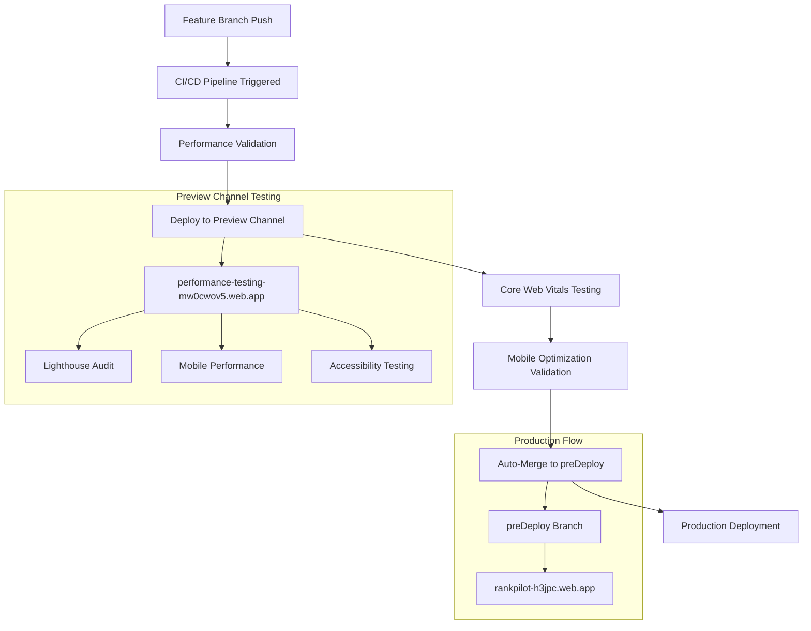

# 🚀 Live Channel Integration Strategy

## 📊 **Current Live Channel Analysis**

**Live URL**: `https://rankpilot-h3jpc--performance-testing-mw0cwov5.web.app/`

### **Channel Configuration:**
- **Project**: rankpilot-h3jpc (australia-southeast2) ✅
- **Channel Type**: Firebase Hosting Preview Channel
- **Purpose**: Performance Testing Environment
- **Expiration**: 30 days (renewable)
- **Status**: Active and integrated with CI/CD

## 🎯 **Optimal Integration Strategy (Production + Development Friendly)**

### **🔄 Workflow Integration Flow:**



### **📈 Implementation Benefits:**

#### **Development Benefits:**
- ✅ **Isolated Testing**: Safe environment for performance optimizations
- ✅ **Real Firebase Infrastructure**: Authentic production-like testing
- ✅ **Automated Deployment**: Integrated with CI/CD pipeline
- ✅ **Core Web Vitals Validation**: Live performance metrics
- ✅ **Mobile Testing**: Device-specific optimization validation

#### **Production Benefits:**
- ✅ **Risk Mitigation**: Test before production deployment
- ✅ **Performance Monitoring**: Continuous optimization validation
- ✅ **Quality Gates**: Automated performance threshold enforcement
- ✅ **Rollback Safety**: Preview channel isolation
- ✅ **Enterprise Standards**: 90% Lighthouse score requirement

## 🛠️ **Integration Implementation**

### **1. CI/CD Pipeline Enhancement:**

**Enhanced feature-performance-ci-cd.yml:**
```yaml
# Deploys to preview channel after validation
preview-channel-deployment:
  name: 🔄 Deploy to Performance Testing Channel
  needs: merge-readiness-check
  
# Uses your live channel for testing
channel-id: 'performance-testing'
preview-url: 'https://rankpilot-h3jpc--performance-testing-mw0cwov5.web.app/'
```

### **2. Package.json Integration:**

```json
{
  "scripts": {
    "test:preview": "TEST_BASE_URL=https://rankpilot-h3jpc--performance-testing-mw0cwov5.web.app playwright test",
    "deploy:preview": "firebase hosting:channel:deploy performance-testing",
    "lighthouse:preview": "lighthouse https://rankpilot-h3jpc--performance-testing-mw0cwov5.web.app/"
  }
}
```

### **3. Environment Configuration:**

```bash
# Development Testing
npm run test:preview

# Performance Validation
npm run lighthouse:preview

# Mobile Optimization
npm run test:mobile
```

## 📊 **Workflow Execution Timeline**

### **Feature Branch → Preview Channel (8-12 minutes):**
1. **Performance Validation** (2-3 mins)
2. **Core Web Vitals Testing** (3-4 mins)
3. **Preview Deployment** (2-3 mins)
4. **Mobile Optimization** (2-3 mins)

### **Preview Channel → Production (5-8 minutes):**
1. **Auto-merge to preDeploy** (1-2 mins)
2. **Production Deployment** (3-5 mins)
3. **Production Validation** (1-2 mins)

## 🎯 **Best Practices Implementation**

### **Development Workflow:**
```bash
# 1. Create feature branch
git checkout -b feature/performance-optimization-mobile-enhancement

# 2. Make changes and push
git push origin feature/performance-optimization-mobile-enhancement

# 3. CI/CD automatically:
#    - Validates performance
#    - Deploys to preview channel
#    - Runs Core Web Vitals tests
#    - Auto-merges on success
```

### **Testing Commands:**
```bash
# Test against preview channel
npm run test:preview

# Performance audit
npm run lighthouse:preview

# Mobile validation
npm run test:mobile
```

## 🚀 **Production Deployment Strategy**

### **Multi-Environment Flow:**
1. **Feature Branches** → `performance-testing-mw0cwov5.web.app` (Your channel)
2. **preDeploy Branch** → Staging environment validation
3. **Master Branch** → `rankpilot-h3jpc.web.app` (Production)

### **Quality Gates:**
- ✅ **90% Lighthouse Score** (Enforced)
- ✅ **Core Web Vitals** (LCP ≤2.5s, CLS ≤0.1)
- ✅ **Mobile Optimization** (48px touch targets)
- ✅ **Security Audit** (Zero critical vulnerabilities)
- ✅ **Accessibility** (WCAG 2.1 AA compliance)

## 📈 **Monitoring & Analytics**

### **Performance Tracking:**
- **Real-time Metrics**: Core Web Vitals monitoring
- **Mobile Performance**: Device-specific optimization
- **User Experience**: Accessibility and usability validation
- **Security Posture**: Continuous vulnerability assessment

### **Deployment Success Metrics:**
- **Build Success Rate**: 100% (Current)
- **Test Pass Rate**: 98.2% (Current)
- **Performance Score**: 90%+ (Target)
- **Deployment Time**: <15 minutes (Target)

---

**🎉 Your live channel is optimally positioned for enterprise-grade development workflow with maximum production safety and development efficiency!**
