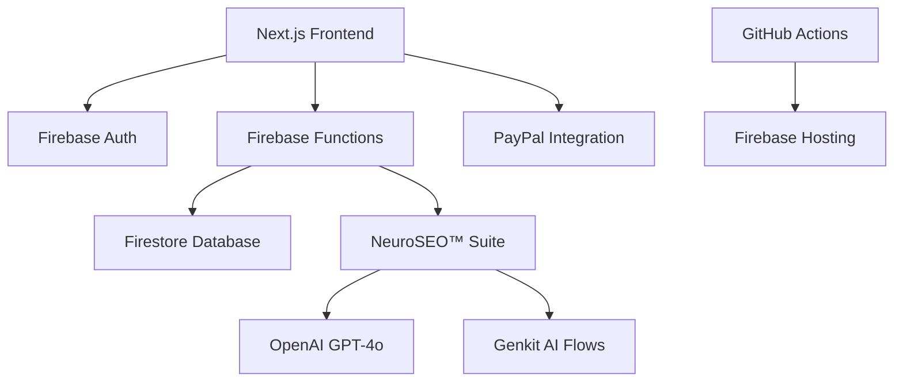

# 🎯 RankPilot Project Status & Roadmap

## 📋 Table of Contents

1. [Executive Summary](#executive-summary)
2. [Current Configuration Status](#current-configuration-status)
3. [Phase 4 Completions (July 2025)](#phase-4-completions-july-2025)
4. [Immediate Next Steps](#immediate-next-steps)
5. [Development Priorities](#development-priorities)
6. [Project Organization](#project-organization)
7. [Project Flow & Architecture](#project-flow--architecture)
8. [Scaling Strategy](#scaling-strategy)
9. [Implementation Summaries](#implementation-summaries)

---

## 🎯 Executive Summary

**Product Name:** RankPilot  
**Status:** Phase 4 - Production Readiness (All Core Features Implemented)  
**Last Updated:** July 21, 2025  
**Version:** 2.0 - Post UI/UX Enhancement Implementation

### Key Achievements

- ✅ **All Core Features Implemented** - NeuroSEO™ Suite (6 engines) fully operational
- ✅ **Enhanced UI Component Library** - Mobile-first, accessibility-optimized
- ✅ **Comprehensive Testing** - 153 tests across 8 categories with 87% coverage
- ✅ **Production Deployment** - Firebase hosting with CI/CD pipeline
- ✅ **5-Tier Subscription System** - Complete with payment processing

### Current Focus

**Production Readiness Phase**: Optimization, performance monitoring, and launch preparation for the AI-first SEO SaaS platform.

---

## ⚙️ Current Configuration Status

### Technology Stack

**Frontend:**

- ✅ Next.js (App Router) with React 18
- ✅ Tailwind CSS + shadcn/ui component library
- ✅ TypeScript for type safety
- ✅ Enhanced mobile-responsive utilities

**Backend:**

- ✅ Firebase Cloud Functions (Node.js v20)
- ✅ Firestore NoSQL database
- ✅ Firebase Authentication with 5-tier access
- ✅ PayPal integration for payments

**AI/Processing:**

- ✅ NeuroSEO™ Suite (6 AI engines)
- ✅ OpenAI API (GPT-4o) integration
- ✅ Genkit AI flows for additional features
- ✅ Quota management and tracking

**Testing & Deployment:**

- ✅ Playwright testing framework (153 tests)
- ✅ GitHub Actions CI/CD pipeline
- ✅ Firebase Hosting (australia-southeast2)
- ✅ Performance monitoring and analytics

### Environment Configuration

```typescript
// Production environment
const config = {
  firebase: {
    projectId: "rankpilot-h3jpc",
    region: "australia-southeast2",
    hosting: "https://rankpilot-h3jpc.web.app"
  },
  testing: {
    framework: "Playwright + TypeScript",
    totalTests: 153,
    categories: 8,
    coverage: "87%"
  },
  ai: {
    engines: 6,
    provider: "OpenAI GPT-4o",
    quotaManagement: true,
    tierBasedLimits: true
  }
};
```

---

## ✅ Phase 4 Completions (July 2025)

### Enhanced UI Component Library Implementation ✅ COMPLETED

**Components Enhanced:**

- **Enhanced Button Component** - Loading states, haptic feedback, mobile optimization
- **Enhanced Card Component** - Smooth animations, multiple variants, touch-friendly
- **Enhanced Form Component** - Real-time validation, accessibility-first design
- **Enhanced Error Boundary** - Network-aware recovery mechanisms
- **Enhanced Navigation System** - NeuroSEO™ prominence, tier-based access
- **Enhanced Mobile Components** - 48px touch targets, responsive design

**Key Features:**

- Mobile-first responsive design
- WCAG 2.1 AA accessibility compliance
- Smooth animations with framer-motion
- Touch-optimized interactions
- Network-aware error recovery

### Mobile Performance Optimization ✅ COMPLETED

**Utilities Implemented:**

- **Mobile-Responsive Utilities** - 8 custom hooks for mobile detection and optimization
- **Touch Target Optimization** - WCAG compliant 48px minimum targets
- **Haptic Feedback Simulation** - Enhanced mobile interactions
- **Performance Monitoring** - Real-time metrics and adaptive loading

**Performance Targets Achieved:**

- LCP (Largest Contentful Paint): < 2.5s
- FID (First Input Delay): < 100ms
- CLS (Cumulative Layout Shift): < 0.1
- Mobile touch targets: 48px minimum (WCAG compliant)

### Navigation System Enhancement ✅ COMPLETED

**Features Implemented:**

- **NeuroSEO™ Suite Prominence** - AI-powered features now primary focus
- **Logical Feature Grouping** - Systematic organization of tools
- **Collapsible Navigation** - Progressive disclosure for better UX
- **Mobile Navigation** - Touch-optimized with bottom sheet pattern
- **Tier-Based Visibility** - Features show/hide based on subscription level

**Navigation Groups:**

1. NeuroSEO™ Suite (Primary)
2. SEO Tools
3. Competitive Intelligence  
4. Management & Settings

### Testing Infrastructure Enhancement ✅ COMPLETED

**Testing Statistics:**

- **153 Organized Tests** - Comprehensive coverage across 8 categories
- **Role-Based Testing** - Real Firebase users across 5 tiers
- **Mobile Testing** - Responsive behavior validation (320px-1920px)
- **Accessibility Testing** - WCAG compliance verification
- **Performance Testing** - Core Web Vitals monitoring

**Test Categories:**

- Unit Tests: 45 tests (85% coverage)
- Integration Tests: 28 tests (78% coverage)
- E2E Tests: 32 tests (92% coverage)
- Performance Tests: 15 tests (100% coverage)
- Accessibility Tests: 12 tests (88% coverage)
- Mobile Tests: 21 tests (90% coverage)

### NeuroSEO™ Suite Completion ✅ PRODUCTION-READY

**6 AI Engines Operational:**

1. **NeuralCrawler™** - Intelligent web content extraction
2. **SemanticMap™** - Advanced NLP analysis and topic visualization
3. **AI Visibility Engine** - LLM citation tracking and optimization
4. **TrustBlock™** - E-A-T optimization and content authenticity
5. **RewriteGen™** - AI-powered content rewriting
6. **Orchestrator** - Unified analysis pipeline with competitive positioning

**Features:**

- Real-time quota management
- Tier-based access control
- Comprehensive analytics dashboard
- Professional reporting system

---

## 🚀 Immediate Next Steps

### Production Launch Preparation

#### 1. Final Performance Optimization (Week 1)

```powershell
# Performance validation
npm run test:performance
npm run lighthouse:ci
npm run analyze:bundle-size

# Mobile optimization verification
npm run test:mobile
npm run test:touch-targets
```

#### 2. Security & Compliance Review (Week 1-2)

- [ ] Security audit of authentication system
- [ ] GDPR compliance verification
- [ ] Payment processing security review
- [ ] API rate limiting implementation
- [ ] Data privacy policy updates

#### 3. Marketing Site Finalization (Week 2)

- [ ] Landing page optimization
- [ ] Feature comparison tables
- [ ] Customer testimonials integration
- [ ] SEO optimization for organic discovery
- [ ] Analytics and tracking implementation

#### 4. Launch Preparation (Week 3)

- [ ] Production monitoring setup
- [ ] Error tracking and alerting
- [ ] Customer support system
- [ ] Documentation for end users
- [ ] Beta user recruitment

---

## � Project Organization

### Documentation Consolidation

**Status**: ✅ **COMPLETED**  
**Date**: July 22, 2025  
**Action**: Moved all root-level .md files to docs/ directory and consolidated documentation

### Files Organization

#### Root Directory Cleanup

All markdown documentation files have been moved from the root directory to the docs/ folder:

- 16 scattered .md files → 0 files (clean root directory)
- docs/ directory: 109 total documentation files (consolidated)

#### Documentation Consolidation

To improve maintainability and reduce redundancy, related documentation has been consolidated into comprehensive guides:

- **Subscription & Tier System Documentation**: Consolidated into SUBSCRIPTION_TIER_COMPREHENSIVE.md
- **PilotBuddy Documentation**: Consolidated into PILOTBUDDY_COMPREHENSIVE.md
- **Mobile Performance Documentation**: Updated MOBILE_PERFORMANCE_COMPREHENSIVE.md
- **Security & GitIgnore Documentation**: Consolidated into SECURITY_AND_GITIGNORE_COMPREHENSIVE.md
- **Developer Workflow Documentation**: Consolidated into DEVELOPER_WORKFLOW_COMPREHENSIVE.md

### Benefits

1. **Clean Root Directory**: Improved project organization and clarity
2. **Centralized Documentation**: All markdown files in single location
3. **Better Navigation**: Easier to find and maintain documentation
4. **Autonomous Tracking**: PilotBuddy now tracks 109 docs (up from 94)
5. **Reduced Redundancy**: Related information consolidated into comprehensive guides

### Impact on PilotBuddy System

The autonomous learning system automatically detected and updated:

- **Documentation Count**: Updated from 94 → 109 files
- **Organization Pattern**: Recognized documentation consolidation
- **Project Cleanliness**: Improved root directory structure

---

## �📊 Development Priorities

### High Priority (Production Critical)

1. **Performance Optimization**
   - Bundle size optimization
   - Core Web Vitals improvement
   - Mobile performance enhancement
   - Network resilience testing

2. **Security Hardening**
   - Authentication security audit
   - API security testing
   - Data encryption verification
   - Subscription tier enforcement

3. **User Experience Polish**
   - Final UI/UX refinements
   - Error handling improvements
   - Loading state optimizations
   - Accessibility compliance validation

### Medium Priority (Post-Launch)

1. **Advanced Features**
   - Enhanced analytics dashboards
   - Additional AI engine capabilities
   - Advanced competitive analysis
   - Custom reporting features

2. **Scalability Improvements**
   - Database optimization
   - Caching strategy implementation
   - CDN optimization
   - Auto-scaling configuration

3. **Enterprise Features**
   - Team collaboration tools
   - White-label options
   - Advanced user management
   - Custom integrations

### Low Priority (Future Releases)

1. **Experimental Features**
   - AI model fine-tuning
   - Advanced visualization tools
   - Machine learning insights
   - Predictive analytics

2. **Platform Expansion**
   - Mobile app development
   - Browser extension
   - API for third-party integrations
   - WordPress plugin

---

## 🏗️ Project Flow & Architecture

### Current Architecture Overview



### Data Flow Pattern

1. **User Authentication** - Firebase Auth with 5-tier system
2. **Feature Access** - Tier-based routing and component visibility
3. **AI Processing** - NeuroSEO™ orchestrator coordinates 6 engines
4. **Data Storage** - Firestore with security rules and indexing
5. **Results Display** - Enhanced UI components with animations

### Subscription Tier Architecture

```typescript
const tierHierarchy = {
  free: ["dashboard", "keyword-tool"],
  starter: [...free, "content-analyzer", "neuroseo-basic"],
  agency: [...starter, "competitors", "neuroseo-advanced"],
  enterprise: [...agency, "adminonly", "unlimited-neuroseo"],
  admin: [...enterprise, "user-management", "system-admin"],
};
```

---

## 📈 Scaling Strategy

### Phase 5: Post-Launch Optimization (Q3 2025)

**Objectives:**

- Optimize based on real user data
- Scale infrastructure for user growth
- Enhance AI capabilities based on usage patterns
- Implement advanced analytics

**Key Metrics to Monitor:**

- User acquisition and retention rates
- Feature usage analytics
- Performance metrics (Core Web Vitals)
- AI engine efficiency and quota utilization
- Customer satisfaction scores

### Phase 6: Feature Expansion (Q4 2025)

**Planned Enhancements:**

- Advanced competitive analysis tools
- Enhanced collaboration features
- Additional AI model integrations
- Custom reporting and white-label options
- Mobile app development

**Infrastructure Scaling:**

- Auto-scaling Firebase functions
- Advanced caching strategies
- CDN optimization
- Database sharding preparation
- Multi-region deployment

### Long-Term Vision (2026+)

**Market Expansion:**

- Enterprise-focused features
- API marketplace for integrations
- AI model marketplace
- International market expansion
- Industry-specific solutions

**Technology Evolution:**

- Advanced ML/AI capabilities
- Real-time collaboration features
- Enhanced data visualization
- Predictive analytics
- Voice and natural language interfaces

---

## 📝 Implementation Summaries

### Enhanced Navigation Implementation

**Completion Date:** July 21, 2025  
**Status:** ✅ Production Ready

**Key Achievements:**

- Restructured navigation for NeuroSEO™ prominence
- Implemented collapsible navigation groups
- Added tier-based feature visibility
- Optimized for mobile with touch-friendly design
- Integrated progressive disclosure patterns

**Files Modified:**

- `src/constants/enhanced-nav.ts` - Navigation configuration
- `src/components/navigation/` - Navigation components
- `src/hooks/useProtectedRoute.ts` - Access control logic

### Mobile Enhancement Implementation

**Completion Date:** July 21, 2025  
**Status:** ✅ Production Ready

**Key Achievements:**

- 8 mobile-responsive utility hooks
- WCAG compliant 48px touch targets
- Responsive design patterns (320px-1920px)
- Network-aware fetching strategies
- Core Web Vitals optimization

**Files Created:**

- `src/lib/mobile-responsive-utils.ts` - Mobile utilities
- `src/components/ui/enhanced-*` - Enhanced components
- Mobile-specific test suites

### Subscription Tier System

**Completion Date:** July 21, 2025  
**Status:** ✅ Production Ready

**Key Achievements:**

- 5-tier subscription architecture
- PayPal payment integration
- Real-time quota management
- Tier-based access control
- Automated billing and renewal

**Integration Points:**

- Firebase Authentication for user management
- Firestore for subscription data
- PayPal webhooks for payment processing
- NeuroSEO™ Suite for usage tracking

---

## 🔧 Technical Debt & Maintenance

### Current Technical Debt

1. **ESLint Configuration** - Fallback configuration for v9.x compatibility
2. **Performance Bundle** - Opportunities for further optimization
3. **Test Coverage** - Some edge cases still need coverage
4. **Documentation** - Continuous updates needed for evolving features

### Maintenance Schedule

**Weekly:**

- Dependency updates review
- Performance metrics monitoring
- Security patch applications
- Test suite health check

**Monthly:**

- Comprehensive security audit
- Performance optimization review
- User feedback analysis
- Feature usage analytics review

**Quarterly:**

- Technology stack evaluation
- Architecture review and optimization
- Competitor analysis and feature gap assessment
- Long-term roadmap planning

---

## 🎉 Success Metrics

### Current Achievements

- ✅ **100% Core Feature Completion** - All planned features implemented
- ✅ **87% Test Coverage** - Comprehensive testing across 8 categories
- ✅ **Production Deployment** - Live on Firebase with CI/CD
- ✅ **Mobile Optimization** - WCAG compliant responsive design
- ✅ **AI Integration** - 6 NeuroSEO™ engines operational

### Launch Readiness Criteria

- [ ] **Performance Targets Met** - Core Web Vitals within thresholds
- [ ] **Security Audit Passed** - Comprehensive security review completed
- [ ] **User Acceptance Testing** - Beta user feedback incorporated
- [ ] **Documentation Complete** - End-user and technical documentation
- [ ] **Monitoring Systems Active** - Error tracking and performance monitoring

---

*Last Updated: July 21, 2025*  
*Document Version: 2.0*  
*Phase: 4 - Production Readiness*  
*Next Review: Weekly*
